<!-- _class: lead -->
<!-- _paginate: False -->
<!-- paginate: Skip -->

# Optimized Virtual Orbital Space (OVOS) for Quantum Computing
## Master's Thesis Defense
**Author:** Tobias Born Clausen
**Supervisors:** Asst. Prof. Phillip W. K. Jensen and Prof. Stephan P. A. Sauer
**Collaboration:** Molecular Quantum Solution (MQS) ApS
**Date:** 11. June 2026

 
 
 
 
 
 

<!--
Notes: Welcome!
-->

---

<!-- header: 
    
        Motivation
    
    
        OVOS
     
-->
<!-- paginate: True -->

## Motivation: The Quantum Bottleneck

- **NISQ Constraint:** Noisy intermediate-scale quantum (NISQ) devices are limited by qubit count and circuit depth.
- **The Challenge:** Post-HF methods (MP2) scale steeply $\mathcal{O}(O^2 V^2)$ due to the virtual orbital space $V$.
- **The Insight:** Most virtual orbitals contribute negligibly to electron correlation.
- **Thesis Goal:** Implement the *Optimized Virtual Orbital Space (OVOS)* method (Adamowicz & Bartlett, 1987) to reduce virtual orbitals while preserving correlation energy. Benchmark these orbitals for VQE performance.

  

    Adamowicz, L. & Bartlett, R. J.
    Optimized virtual orbital space for high-level correlated calculations
     [J. Chem. Phys. 86, 6314-6324 (1987)]
DOI: [10.1063/1.452468](https://doi.org/10.1063/1.452468)
  

<!--
Speaker Notes: 
- NOISY...
- 1000 QUBITS...
- BIG BASIS SET -> LARGE VIRTUAL SPACE -> HIGH COST

- The **computational bottleneck** that motivates everything we do in this thesis.
- That is exactly what the **OVOS method** does...
- I implement OVOS and then ask...
- OVOS -> REDUCED VIRTUAL SPACE -> LOWER COST

**Transition to next slide:**  
"With that motivation in mind, let me now walk you through the **theory** behind OVOS
– how it defines the active virtual space and how we optimise it."
-->

---

<!-- class: title-card -->
<!-- header: 
    
    
    
    
-->
<!-- paginate: Skip -->

Theory

Partitioning - Optimisation

<!--
...
-->

---

<!-- class: False -->
<!-- header: 
    
        Theory
    
    
        OVOS
     
-->
<!-- paginate: True -->

## Theory: Partitioning

- **Index:** The virtual orbital space is partitioned into three subspaces:

 

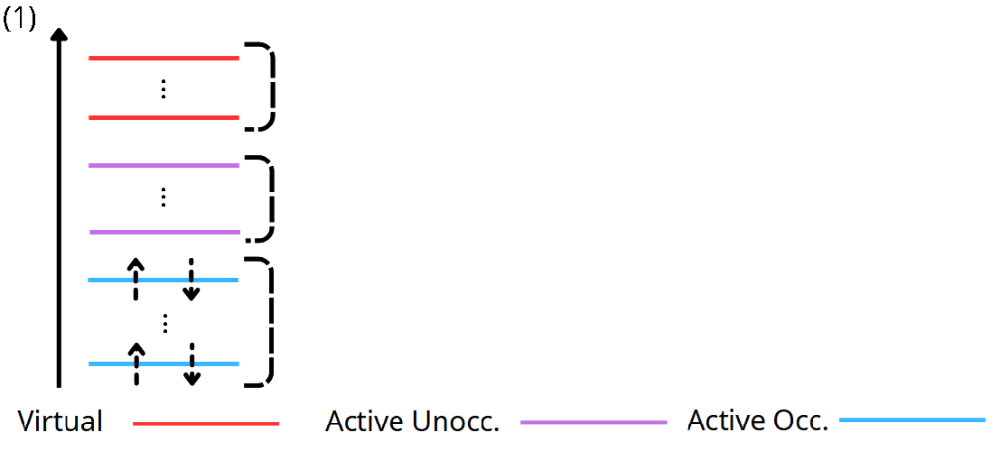

<!--
Speaker Notes: 
- OVOS partitions the full spin‑orbital basis into three subspaces...
- Here the orbitals are unrestricted...
-->

---

<!-- class: False -->
<!-- header: 
    
        Theory
    
    
        OVOS
     
-->
<!-- paginate: hold -->

## Theory: Partitioning

- **Index:** The virtual orbital space is partitioned into three subspaces:

 

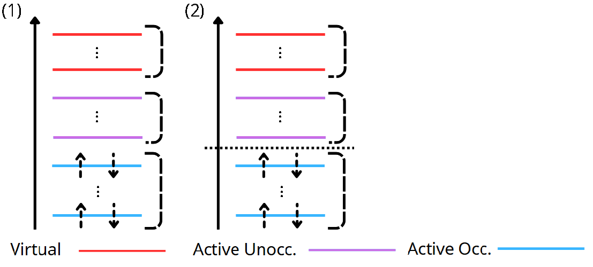

<!--
Speaker Notes: ...
-->

---

<!-- class: False -->
<!-- header: 
    
        Theory
    
    
        OVOS
     
-->
<!-- paginate: hold -->

## Theory: Partitioning

- **Index:** The virtual orbital space is partitioned into three subspaces:

 

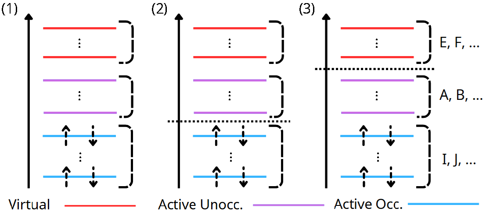

<!--
Speaker Notes: ...
-->

---

<!-- header: 
    
        Theory, Partitioning
    
    
        OVOS
     
-->
<!-- paginate: True -->

- **Goal:** Find the optimal virtual subspace for capturing electron correlation.

 

<!--
Speaker Notes: 
- The goal of OVOS is to find the optimal virtual subspace for capturing electron correlation...
-->

---

<!-- header: 
    
        Theory, Partitioning
    
    
        OVOS
     
-->
<!-- paginate: hold -->

- **Goal:** Find the optimal virtual subspace for capturing electron correlation.

 

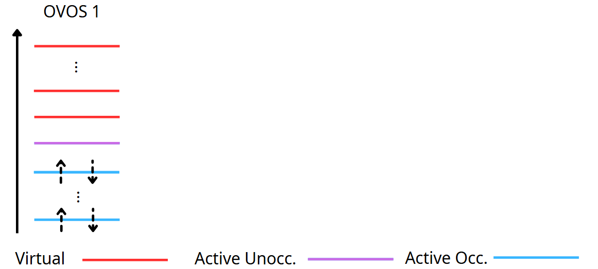

<!--
Speaker Notes: 
- A simple naive approach...
- A&B, Overhead from pre-MP2 calc...
-->

---

<!-- header: 
    
        Theory, Partitioning
    
    
        OVOS
     
-->
<!-- paginate: hold -->

- **Goal:** Find the optimal virtual subspace for capturing electron correlation.

 

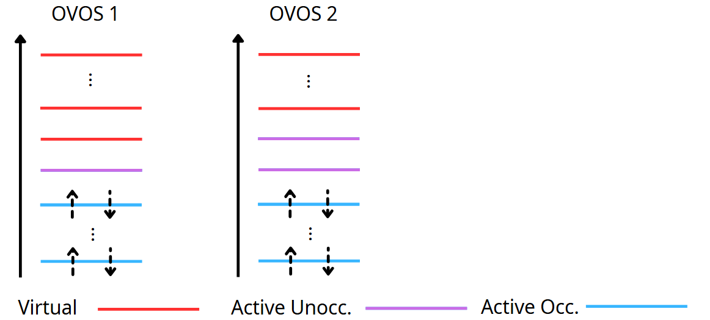

<!--
Speaker Notes: ...
-->

---

<!-- header: 
    
        Theory, Partitioning
    
    
        OVOS
     
-->
<!-- paginate: hold -->

- **Goal:** Find the optimal virtual subspace for capturing electron correlation.

 

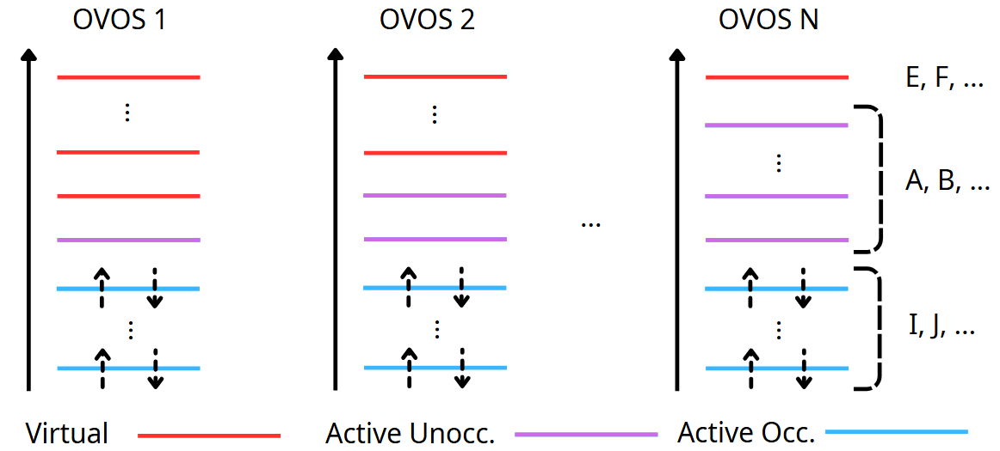

N' = N - 1, N - 2, ..., 1 active unoccupied orbital, N' < N

<!--
Speaker Notes: 
- Add to N' = N-1 ...
- AT N' = N ...
- Optimization...
-->

---

<!-- header: 
    
        Theory, Optimisation
    
    
        OVOS
     
-->
<!-- paginate: True -->

## Theory: Optimisation

 

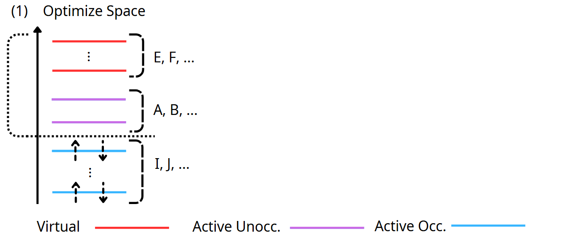

<!--
Speaker Notes: 
- To give the overveiw of this optimisation loop...
-->

---

<!-- header: 
    
        Theory, Optimisation
    
    
        OVOS
     
-->
<!-- paginate: hold -->

## Theory: Optimisation

 

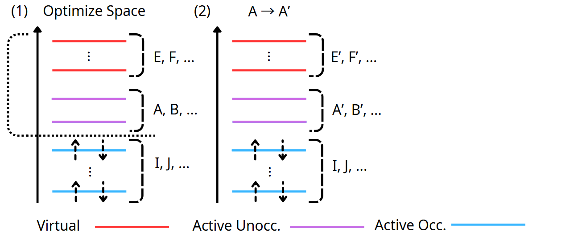

<!--
Speaker Notes: ...
- A broad overview of the optimisation loop...
-->

---

<!-- header: 
    
        Theory, Optimisation
    
    
        OVOS
     
-->
<!-- paginate: hold -->

## Theory: Optimisation

 

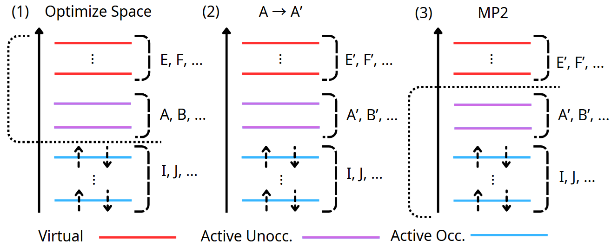

<!--
Speaker Notes: ...
-->

---

<!-- header: 
    
        Theory, Optimisation
    
    
        OVOS
     
-->
<!-- paginate: True -->

### The Hylleraas Functional

- **Framework:**

$$E^{(2)} \leq \langle\Psi^{(1)}|H_0 - E^{(0)}|\Psi^{(1)}\rangle + 2\langle\Psi^{(1)}|V - E^{(1)}|\Psi^{(0)}\rangle = J^{(2)}$$

<!--
- The second-order Hylleraas functional is used to find an optimal 
rotation of the active virtual space against the nonactive 
space, to minimize the second-order correlation energy.
- The Theory behind the OVOS optimisation ... 
- The second‑order Hylleraas functional J^{(2)} is the variational target that OVOS minimises 
- Orthogonal condition <\Psi^{(1)}|\Psi^{(0)}> = 0
-->

---

<!-- header: 
    
        Theory, Optimisation
    
    
        OVOS
     
-->
<!-- paginate: hold -->

### The Hylleraas Functional

- **Framework:**

$$E^{(2)} \leq \langle\Psi^{(1)}|H_0 - E^{(0)}|\Psi^{(1)}\rangle + 2\langle\Psi^{(1)}|V - E^{(1)}|\Psi^{(0)}\rangle = J^{(2)}$$

Perturbation theory framework: H = H₀ + V, Eₕ = E₀ + E₁ | Orthogonal: <Ψ¹|Ψ⁰> = 0

<!--
- The second-order Hylleraas functional is used to find an optimal 
rotation of the active virtual space against the nonactive 
space, to minimize the second-order correlation energy.
- V!!!!
- Energy HF !!!
- Orthonormal condition <\Psi^{(1)}|\Psi^{(0)}> = 0
-->

---

<!-- header: 
    
        Theory, Optimisation
    
    
        OVOS
     
-->
<!-- paginate: True -->

### The Hylleraas Functional

- **Framework:**

$$E^{(2)} \leq \langle\Psi^{(1)}|H_0 - E^{(0)}|\Psi^{(1)}\rangle + 2\langle\Psi^{(1)}|V - E^{(1)}|\Psi^{(0)}\rangle = J^{(2)}$$

- **MP1 amplitude:**

$$
\begin{align*}
    \frac{\partial J^{(2)}}{\partial \Psi^{(1)}} = 0, \quad \Psi^{(1)} = \sum_{i>j,a>b} t_{ij}^{ab} |_{ij}^{ab}\rangle \quad \longrightarrow \quad t_{ij}^{ab} = \frac{\langle ab\|ij\rangle}{\epsilon_i + \epsilon_j - \epsilon_a - \epsilon_b}
\end{align*}
$$

Perturbation theory framework: H = H₀ + V, Eₕ = E₀ + E₁ | Orthogonal: <Ψ¹|Ψ⁰> = 0

<!--
- The second-order Hylleraas functional is used to find an optimal 
rotation of the active virtual space against the nonactive 
space, to minimize the second-order correlation energy.
- Get to MP1 amplitudes by setting the derivative of J^{(2)} w.r.t. Ψ^{(1)} to zero...
- >Ψ¹ is a linear combination of 
- two-electron excited determinants...
- Ψ⁰ SCF reference...
-->

---

<!-- header: 
    
        Theory, Optimisation
    
    
        OVOS
     
-->
<!-- paginate: hold -->

### The Hylleraas Functional

- **Framework:**

$$E^{(2)} \leq \langle\Psi^{(1)}|H_0 - E^{(0)}|\Psi^{(1)}\rangle + 2\langle\Psi^{(1)}|V - E^{(1)}|\Psi^{(0)}\rangle = J^{(2)}$$

- **Functional Form:**

$$
\begin{align*}
    J^{(2)} = \sum_{i>j} J_{ij}^{(2)}
\end{align*}
$$

<!--
Speaker Notes: ...
- Pair separaible functional...
- Unique pairs...
-->

---

<!-- header: 
    
        Theory, Optimisation
    
    
        OVOS
     
-->
<!-- paginate: hold -->

### The Hylleraas Functional

- **Framework:** The **Hylleraas functional**

$$E^{(2)} \leq \langle\Psi^{(1)}|H_0 - E^{(0)}|\Psi^{(1)}\rangle + 2\langle\Psi^{(1)}|V - E^{(1)}|\Psi^{(0)}\rangle = J^{(2)}$$

- **Functional Form:**

$$
\begin{align*}
    J_{ij}^{(2)} = \sum_{a>b,c>d} &t_{ij}^{ab} t_{ij}^{cd} \Big(f_{ac}\delta_{bd} - f_{ad}\delta_{bc} + f_{bd}\delta_{ac} - f_{bc}\delta_{ad} \\ &- (\epsilon_i + \epsilon_j)(\delta_{ac}\delta_{bd} - \delta_{ad}\delta_{bc})\Big) + 2\sum_{a>b} t_{ij}^{ab} \langle ij\|ab\rangle
\end{align*}
$$

<!--
Notes: Equations for the Hylleraas functional, and MP2 correlation energy...
Speaker Notes: ...
- Unique Pairs...
- Rotated MO's ... 
- Space...
-->

---

<!-- header: 
    
        Theory, Optimisation
    
    
        OVOS
     
-->
<!-- paginate: True -->

### Derivatives

<!--
Speaker Notes: ... 
- J2 -> Landscape...
-->

---

<!-- header: 
    
        Theory, Optimisation
    
    
        OVOS
     
-->
<!-- paginate: hold -->

### Derivatives

- **Gradient:**

$$
\begin{align*}
    G_{ae} = \frac{\partial J^{(2)}}{\partial R_{ae}} \qquad (N' N_{\text{inact.}})
\end{align*}
$$

<!--
Speaker Notes: ... 
- DRAW: Slope ...
- R_ae: Rotation parameters for active-inactive orbital pairs...
- Stationary point: G = 0 -> Optimal virtual subspace...
-->

---

<!-- header: 
    
        Theory, Optimisation
    
    
        OVOS
     
-->
<!-- paginate: True -->

### Derivatives

- **Hessian:**

$$
\begin{align*}
    H_{ae,bf} &= \frac{\partial^2 J^{(2)}}{\partial R_{ae}\ \partial R_{bf}} \qquad (N' N_{\text{inact.}}) \times (N' N_{\text{inact.}})
\end{align*}
$$

<!--
Speaker Notes: ... 
- DRAW: Curvature ...
    - Local minimum, Local maximum, Saddle point...
- H: Block structure...
- H: Diag block (N' X N')
-->

---

<!-- header: 
    
        Theory, Optimisation
    
    
        OVOS
     
-->
<!-- paginate: hold -->

### Derivatives

- **Hessian:**

$$
\begin{align*}
    H_{ae,bf} &= \frac{\partial^2 J^{(2)}}{\partial R_{ae}\ \partial R_{bf}} \qquad (N' N_{\text{inact.}}) \times (N' N_{\text{inact.}})
\end{align*}
$$

*Block structure:*
$$
\mathbf{H} =
    \begin{bmatrix}
        \mathbf{H^e}        & 0           & \cdots & 0         \\
        0          & \mathbf{H^f}         & \cdots & 0         \\
        \vdots     & \vdots      & \ddots & \vdots    \\
        0          & 0           & \cdots & \mathbf{H^{N_{\text{inact.}}}}
    \end{bmatrix},
\qquad
\qquad\qquad\qquad\qquad\qquad\qquad\qquad\qquad\quad
$$

<!--
Notes: Gradient and Hessian expression for the Hylleraas functional...
Speaker Notes: ... 
- H: Block structure...
- H: Diag block (N' X N')
-->

---

<!-- header: 
    
        Theory, Optimisation
    
    
        OVOS
     
-->
<!-- paginate: hold -->

### Derivatives

- **Hessian:**

$$
\begin{align*}
    H_{ae,bf} &= \frac{\partial^2 J^{(2)}}{\partial R_{ae}\ \partial R_{bf}} \qquad (N' N_{\text{inact.}}) \times (N' N_{\text{inact.}})
\end{align*}
$$

*Block structure:*
$$
\mathbf{H} =
    \begin{bmatrix}
        \mathbf{H^e}        & 0           & \cdots & 0         \\
        0          & \mathbf{H^f}         & \cdots & 0         \\
        \vdots     & \vdots      & \ddots & \vdots    \\
        0          & 0           & \cdots & \mathbf{H^{N_{\text{inact.}}}}
    \end{bmatrix},
\qquad
\mathbf{H^e} = 
    \begin{bmatrix}
        H_{ae,ae}  & H_{ae,be} & \cdots & H_{ae,N'e}   \\
        H_{be,ae}  & H_{be,be} & \cdots & H_{be,N'e}   \\
        \vdots     & \vdots    & \ddots & \vdots       \\
        H_{N'e,ae} & 0         & \cdots & H_{N'e,N'e}
    \end{bmatrix}
$$

<!--
Speaker Notes: ... 
- H: Block structure...
- H: Diag block (N' X N')
-->

---

<!-- header: 
    
        Theory, Optimisation
    
    
        OVOS
     
-->
<!-- paginate: True -->

### Newton–Raphson

**Rotation:**

$$
\begin{align*}
    \mathbf{R} = - \mathbf{G} \cdot \mathbf{H}^{-1}
\end{align*}
$$

<!--
Speaker Notes: ...
- NR: Obtain rotation parameters R...
-->

---

<!-- header: 
    
        Theory, Optimisation
    
    
        OVOS
     
-->
<!-- paginate: hold -->

### Newton–Raphson

**Rotation:**

$$
\begin{align*}
    \mathbf{R} = - \mathbf{G} \cdot \mathbf{H}^{-1}
\end{align*}
$$

*Block structure:*
$$
\mathbf{R} =
    \begin{bmatrix}
        0  & -\mathbf{R_{ea}} \\
        \mathbf{R_{ae}} & 0
    \end{bmatrix}, \qquad \mathbf{R_{ae}} = -\mathbf{R_{ea}} \qquad  (N' \times N_{\text{inact.}})
$$

<!--
Speaker Notes: ...
- Act-Act orbital != MP2
- Only Act-Inact. orbital rotations...
- Anti-symmetric structure of R...
-->

---

<!-- header: 
    
        Theory, Optimisation
    
    
        OVOS
     
-->
<!-- paginate: hold -->

### Newton–Raphson

**Rotation:**

$$
\begin{align*}
    \mathbf{R} = - \mathbf{G} \cdot \mathbf{H}^{-1}
\end{align*}
$$

*Block structure:*
$$
\mathbf{R} =
    \begin{bmatrix}
        0  & -\mathbf{R_{ea}} \\
        \mathbf{R_{ae}} & 0
    \end{bmatrix}, \qquad \mathbf{R_{ae}} = -\mathbf{R_{ea}} \qquad  (N' \times N_{\text{inact.}})
$$

*Rotation:*
$$
\phi_a \rightarrow \phi_a' = \phi_a + \sum_e R_{ae} \phi_e - \frac{1}{2} \sum_{b,e} R_{ea} R_{eb} \phi_b + \cdots
$$

<!--
Speaker Notes: ...
- Add onto MO ...
- R_ae: Rotation parameters for active-inactive orbital pairs...
-->

---

<!-- header: 
    
        Theory, Optimisation
    
    
        OVOS
     
-->
<!-- paginate: True -->

### Unitary Rotation

**Coefficients:**

$$\mathbf{U} = e^{\mathbf{R}} \quad \longrightarrow \quad \mathbf{U}\mathbf{C}\mathbf{U}^\dagger = \mathbf{C}'\qquad (\mathbf{U}^\dagger \mathbf{U} = \mathbf{I}) $$

<!--
Speaker Notes: ...
- NR: Obtain rotation parameters R...
- UR: Apply rotation to virtual orbitals to get new coefficients C'... 
- UR: Mixes the virtual orbitals, preserving orthonormality...
-->

---

<!-- header: 
    
        Theory, Optimisation
    
    
        OVOS
     
-->
<!-- paginate: hold -->

### Unitary Rotation

**Coefficients:**

$$\mathbf{U} = e^{\mathbf{R}} \quad \longrightarrow \quad \mathbf{U}\mathbf{C}\mathbf{U}^\dagger = \mathbf{C}'\qquad (\mathbf{U}^\dagger \mathbf{U} = \mathbf{I}) $$

### Canonicalization

**Orbital Canonicalization:**

$$\mathbf{F_{\text{ab}}'} = \mathbf{{C'}_{\text{ab}}^\dagger }\mathbf{F_{\text{ab}}} \mathbf{C'_{\text{ab}}} \quad \longrightarrow \quad \mathbf{F_{\text{ab}}'}\mathbf{C''}=\mathbf{C''}\epsilon$$

<!--
Speaker Notes: ...
- CANONICALIZE -> Well-defined orbital energies
- OC: Ater UR, CANONICALIZE the virtual orbitals
- OC: Maintain orbital energies, ensure stability of optimisation...
- OC: Eigenvectors and eigenvalues of the active Fock block...
- OC: Eigenvalues -> MP1 amplitudes...
-->

---

<!-- header: 
    
        Theory, Optimisation
    
    
        OVOS
     
-->
<!-- paginate: hold -->

### Unitary Rotation

**Coefficients:**

$$\mathbf{U} = e^{\mathbf{R}} \quad \longrightarrow \quad \mathbf{U}\mathbf{C}\mathbf{U}^\dagger = \mathbf{C}'\qquad (\mathbf{U}^\dagger \mathbf{U} = \mathbf{I}) $$

### Canonicalization

**Orbital Canonicalization:**

$$\mathbf{F_{\text{ab}}'} = \mathbf{{C'}_{\text{ab}}^\dagger }\mathbf{F_{\text{ab}}} \mathbf{C'_{\text{ab}}} \quad \longrightarrow \quad \mathbf{F_{\text{ab}}'}\mathbf{C''}=\mathbf{C''}\epsilon$$
$$\epsilon \longrightarrow \text{MP1 amplitudes}$$

<!--
Speaker Notes: ...
- OC: Eigenvalues -> MP1 amplitudes...
-->

---

<!-- class: title-card -->
<!-- header: 
    
    
    
    
-->
<!-- paginate: Skip -->

Method

Implementation - Computational Details

<!--
Speaker Notes: ...
-->

---

<!-- class: False -->
<!-- header: 
    
        Method
    
    
        OVOS
     
-->
<!-- paginate: True -->

## Method: Implementation

**Software:** Implemented and benchmarked OVOS w. PySCF, and SlowQuant.

<!--
Speaker Notes: ...
- PySCF -> Molecule, SCF, integrals
- SlowQuant -> VQE...
-->

---

<!-- class: False -->
<!-- header: 
    
        Method, Implementation - OVOS
    
    
        OVOS
     
-->
<!-- paginate: True -->

### OVOS

  
Algorithm 1: OVOS Iterative Optimisation

  
Perform  SCF calculation

  
Select  Initial virtual orbital space

  
Transform  AO integrals to MO basis

  
Repeat 

  
Compute MP1 amplitudes and MP2 

  
Assemble gradient and Hessian 

  
Solve Newton–Raphson

  
Generate Unitary Matrix

  
Update MO coefficients 

  
Canonicalize active Fock block

  
Evaluate new MP2 

  
Until convergence 

<!--
Speaker Notes: ...
- Implemented both restricted and unrestricted orbitals...
-->

---

<!-- header: 
    
        Method, Implementation - OVOS
    
    
        OVOS
     
-->
<!-- paginate: True -->

**Perform** SCF calculation to obtain initial orbitals and Fock matrix

<pre><code class="language-python">   # OVOS
ovos = OVOS(mol=mol,                 # Molecule object
            scf=mf,                  # SCF object
            Fao=Fao,                 # AO Fock matrix
            num_opt_virtual_orbs=2,  
            mo_coeff=mo_coeffs,      # Initial MO coefficients
            init_orbs="RHF",
            verbose=1,
            max_iter=1000,
            conv_energy=1e-8,
            conv_grad=1e-6,
            keep_track_max=50
            ).run(...)
</code></pre>

<!--
Speaker Notes: ...
-->

---

<!-- header: 
    
        Method, Implementation - OVOS
    
    
        OVOS
     
-->
<!-- paginate: hold -->

**Select** initial virtual orbital space

<pre><code class="language-python">   # OVOS
ovos = OVOS(mol=mol,
            scf=mf,
            Fao=Fao,
            num_opt_virtual_orbs=2,  # Number of active unoccupied orbitals
            mo_coeff=mo_coeffs,
            init_orbs="RHF",
            verbose=1,
            max_iter=1000,
            conv_energy=1e-8,
            conv_grad=1e-6,
            keep_track_max=50
            ).run(...)
</code></pre>

<!--
Speaker Notes: ...
-->

---

<!-- header: 
    
        Method, Implementation - OVOS
    
    
        OVOS
     
-->
<!-- paginate: hold -->

**Select** initial virtual orbital space

<pre><code class="language-python">   # OVOS
ovos = OVOS(mol=mol,
            scf=mf,
            Fao=Fao,
            num_opt_virtual_orbs=2,  # Number of active unoccupied orbitals
            mo_coeff=mo_coeffs,      # Initial MO coefficients
            init_orbs="RHF",
            verbose=1,
            max_iter=1000,
            conv_energy=1e-8,
            conv_grad=1e-6,
            keep_track_max=50
            ).run(...)
</code></pre>

<!--
Speaker Notes: ...
-->

---

<!-- header: 
    
        Method, Implementation - OVOS
    
    
        OVOS
     
-->
<!-- paginate: hold -->

**Select** initial virtual orbital space

<pre><code class="language-python">   # OVOS
ovos = OVOS(mol=mol,
            scf=mf,
            Fao=Fao,
            num_opt_virtual_orbs=2,  # Number of active unoccupied orbitals
            mo_coeff=mo_coeffs,      # Initial MO coefficients
            init_orbs="RHF",         # Unrestricted/restricted orbitals
            verbose=1,
            max_iter=1000,
            conv_energy=1e-8,
            conv_grad=1e-6,
            keep_track_max=50
            ).run(...)
</code></pre>

<!--
Speaker Notes: ...
- Restricted: mo_coeffs[0] = mo_coeffs[1] = mf.mo_coeff
- Unrestricted: mo_coeffs[0] = mf.mo_coeff_alpha, mo_coeffs[1] = mf.mo_coeff_beta
- Twice the orbitals... alpha/beta...
-->

---

<!-- header: 
    
        Method, Implementation - OVOS
    
    
        OVOS
     
-->
<!-- paginate: hold -->

**Select** initial virtual orbital space

<pre><code class="language-python">   # OVOS
ovos = OVOS(mol=mol,
            scf=mf,
            Fao=Fao,
            num_opt_virtual_orbs=2,
            mo_coeff=mo_coeffs,
            init_orbs="RHF",
            verbose=1,
            max_iter=1000,
            conv_energy=1e-8,
            conv_grad=1e-6,
            keep_track_max=50
            ).run(...)
</code></pre>

<!--
Speaker Notes: ...
- Restricted: mo_coeffs[0] = mo_coeffs[1] = mf.mo_coeff
- Unrestricted: mo_coeffs[0] = mf.mo_coeff_alpha, mo_coeffs[1] = mf.mo_coeff_beta
- Twice the orbitals... alpha/beta...
-->

---

<!-- header: 
    
        Method, Implementation - OVOS
    
    
        OVOS
     
-->
<!-- paginate: hold -->

**Select** initial virtual orbital space

<pre><code class="language-python">   # OVOS
ovos = OVOS(...).run(mo_coeff=mo_coeffs,      # MO coefficients
                     fock_spin=fock_spin      # Fock matrix in spin
                     )
</code></pre>

<!--
Speaker Notes: ...
- INSIDE THE RUN!!!!
-->

---

<!-- header: 
    
        Method, Implementation - OVOS
    
    
        OVOS
     
-->
<!-- paginate: True -->

**Repeat** until convergence

 

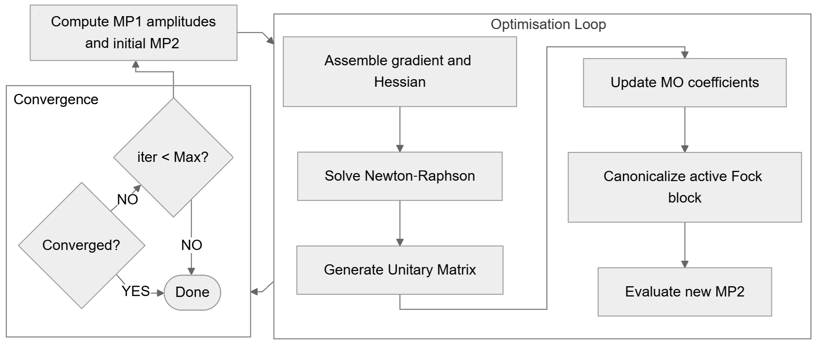

<!--
Speaker Notes: ...
- INITIAL...
- CONVERGENCE...
- LOOP...
-->

---

<!-- class: False -->
<!-- header: 
    
        Method, Implementation - VQE
    
    
        OVOS
     
-->
<!-- paginate: True -->

### VQE

  
Algorithm 2: VQE Workflow (Classical)

  
Perform  Orbital reference state 

  
Select  Active space 

  
Set  Orbital optimization True/False

  
Initialise  Theta parameters from previous or random 

  
Run  Unrestricted wavefunction unitary product state †
 

  
Optimise  Theta parameters with classical optimiser BFGS

$^\dagger$ $|\Psi\rangle = \prod_P \hat{U}_P |\Phi_{\text{ref}}\rangle$

  

    Pernille Volsgaard
    SlowQuant: Unrestricted Variational Quantum Eigensolver
       [Branch: https://github.com/erikkjellgren/SlowQuant/tree/unrestricted_vqe]
  

<!--
Speaker Notes: ...
- Q-Gates -> Unitary operators...
- NON-Classical
- Quantum HYBRID algorithm...
- Exact, Compact, Conserve properties of Hamiltonian...
- BFGS stands for Broyden–Fletcher–Goldfarb–Shanno algorithm (quasi-NR method for optimization)...
-->

---

<!-- header: 
    
        Method, Implementation - VQE
    
    
        OVOS
     
-->

**Run** Unrestricted wavefunction unitary product space.

<pre><code class="language-python">wf = UnrestrictedWaveFunctionUPS(
        mol.nelectron,
        ((mol.nelectron//2, mol.nelectron//2),        # Electron count by spin
        num_electrons//2+num_opt_virtual_orbs),       # Active space
        mo_coeffs,                                    # Orbtial coefficients
        h_core,
        g_eri,
        "utups",
        {"n_layers": 1},
        include_active_kappa=False)
</code></pre>

  

    Pernille Volsgaard
    SlowQuant: Unrestricted Variational Quantum Eigensolver
       [Branch: https://github.com/erikkjellgren/SlowQuant/tree/unrestricted_vqe]
  

<!--
Speaker Notes: ...
-->

---

<!-- header: 
    
        Method, Implementation - VQE
    
    
        OVOS
     
-->
<!-- paginate: hold -->

**Run** Unrestricted wavefunction unitary product space.

<pre><code class="language-python">wf = UnrestrictedWaveFunctionUPS(
        mol.nelectron,
        ((mol.nelectron//2, mol.nelectron//2),
        num_electrons//2+num_opt_virtual_orbs),
        mo_coeffs,
        h_core,
        g_eri,
        "utups",                                      # Ansatz type
        {"n_layers": 1},                              # Layers in ansatz
        include_active_kappa=False)
</code></pre>

  

    Pernille Volsgaard
    SlowQuant: Unrestricted Variational Quantum Eigensolver
       [Branch: https://github.com/erikkjellgren/SlowQuant/tree/unrestricted_vqe]
  

<!--
Speaker Notes: ...
- Circuit !!!
- Layers improve accuracy, but increase cost...
- Tiled means \hat{U} tiles...
- Accuracy, move qubits by spin...
-->

---

<!-- header: 
    
        Method, Implementation - VQE
    
    
        OVOS
     
-->
<!-- paginate: hold -->

**Run** Unrestricted wavefunction unitary product space.

<pre><code class="language-python">wf = UnrestrictedWaveFunctionUPS(
        mol.nelectron,
        ((mol.nelectron//2, mol.nelectron//2),
        num_electrons//2+num_opt_virtual_orbs),       # Active space
        mo_coeffs,                                    # Orbtial coefficients
        h_core,
        g_eri,
        "utups",
        {"n_layers": 1},
        include_active_kappa=False)
</code></pre>

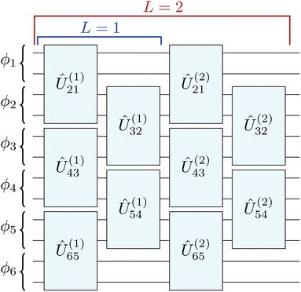

  

    Pernille Volsgaard
    SlowQuant: Unrestricted Variational Quantum Eigensolver
       [Branch: https://github.com/erikkjellgren/SlowQuant/tree/unrestricted_vqe]
  

<!--
Speaker Notes: ...
- Circuit !!!
- Layers improve accuracy, but increase cost...
- Tiled means \hat{U} tiles...
- Accuracy, move qubits by spin...
-->

---

<!-- header: 
    
        Method, Implementation - VQE
    
    
        OVOS
     
-->
<!-- paginate: True -->

**Optimise:** Theta parameters w. classical optimiser BFGS.

<pre><code class="language-python"> wf.thetas = theta_init
wf.run_wf_optimization_1step(
        "BFGS",
        orbital_optimization,
        atol=1e-6,
        maxiter)
</code></pre>

<!--
Speaker Notes: ...
- quasi-Newton-Raphson method for optimization...
-->

---

<!-- class: title-card -->
<!-- header: 
    
    
    
    
-->
<!-- paginate: Skip -->

Results

OVOS - VQE - ooVQE

<!--
Speaker Notes: ...
-->

---

<!-- class: False -->
<!-- header: 
    
        Results, Computational Details
    
    
        OVOS
     
-->
<!-- paginate: True -->

## Computational Details

- **Molecules:** H₂O CO, HF, NH₃, Li₂.
- **Basis Set:** 6-31G, cc-pVDZ.
- **Start guesses:** Orbitals from HF, previous OVOS, and random.
- **Convergence Criteria:** Energy change < 1e-8 Ha, gradient norm < 1e-6.

<!-- 
Speaker Notes: ...
Molecules: H2O -> Water ,CO -> Carbon Monoxide, HF -> Hydrogen Fluoride, NH3 -> NH3 = Ammonia
-> Li2 = Dilithiuma. (Different sizes...)
-> Varying spaces...
-> Basis sets: 6-31G (smaller), cc-pVDZ (larger, more accurate)...
-->

---

<!-- class: False -->
<!-- header: 
    
        Results, Computational Details
    
    
        OVOS
     
-->
<!-- paginate: hold -->

## Computational Details

- **Molecules:** ***H₂O***, CO, ***HF***, NH₃, ***Li₂***.
- **Basis Set:** 6-31G, cc-pVDZ.
- **Start guesses:** Orbitals from HF, previous OVOS, and random.
- **Convergence Criteria:** Energy change < 1e-8 Ha, gradient norm < 1e-6.

<!-- 
Speaker Notes: ...
Molecules: H2O -> Water ,CO -> Carbon Monoxide, HF -> Hydrogen Fluoride, NH3 -> NH3 = Ammonia
-> Li2 = Dilithiuma. (Different sizes...)
-> Varying spaces...
-> Basis sets: 6-31G (smaller), cc-pVDZ (larger, more accurate)...
-->

---

<!-- class: False -->
<!-- header: 
    
        Results, Computational Details
    
    
        OVOS
     
-->
<!-- paginate: hold -->

## Computational Details

- **Molecules:** ***H₂O***, CO, ***HF***, NH₃, ***Li₂***.
- **Basis Set:** 6-31G, ***cc-pVDZ***.
- **Start guesses:** Orbitals from HF, previous OVOS, and random.
- **Convergence Criteria:** Energy change < 1e-8 Ha, gradient norm < 1e-6.

<!-- 
Speaker Notes: ...
Molecules: H2O -> Water ,CO -> Carbon Monoxide, HF -> Hydrogen Fluoride, NH3 -> NH3 = Ammonia
-> Li2 = Dilithiuma. (Different sizes...)
-> Varying spaces...
-> Basis sets: 6-31G (smaller), cc-pVDZ (larger, more accurate)...
-->

---

<!-- header: 
    
        Results, OVOS
    
    
        OVOS
     
-->
<!-- paginate: True -->

## Results: OVOS

<!--
Speaker Notes: ...
-->

---

<!-- header: 
    
        Results, OVOS - H2O ***HF*** ***Li2***
    
    
        OVOS
     
-->
<!-- paginate: True -->

<!-- ## Results: OVOS -->
<!-- **PLOTS - H2O/cc-pVDZ** -->

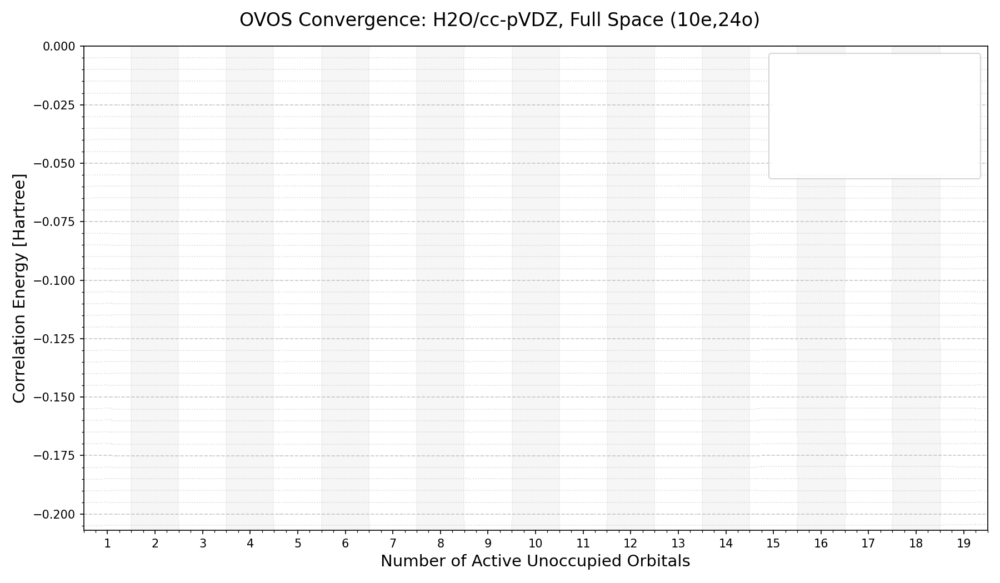

<!--
- Speaker Notes: ...
-->

---

<!-- header: 
    
        Results, OVOS - H2O ***HF*** ***Li2***
    
    
        OVOS
     
-->
<!-- paginate: hold -->

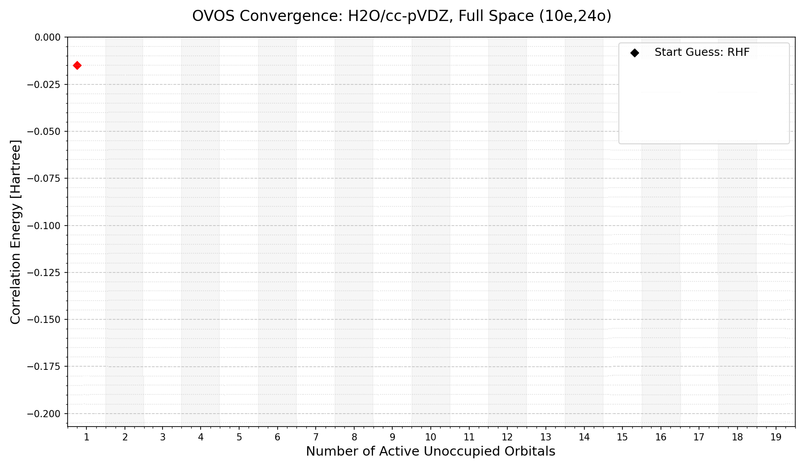

<!--
Speaker Notes: ...
- *Points:* MP2 correlation energy at each iteration.
- *Lines:* Amount of recovered correlation energy from initial point to final OVOS solution.
- *Grey Line:* Best of start Guesses (canonical HF, previous OVOS, random).
- *Dashed Lines:* Reference MP2, and orbital optimised MP2 (both with full virtual space).

-->

---

<!-- header: 
    
        Results, OVOS - H2O ***HF*** ***Li2***
    
    
        OVOS
     
-->
<!-- paginate: hold -->

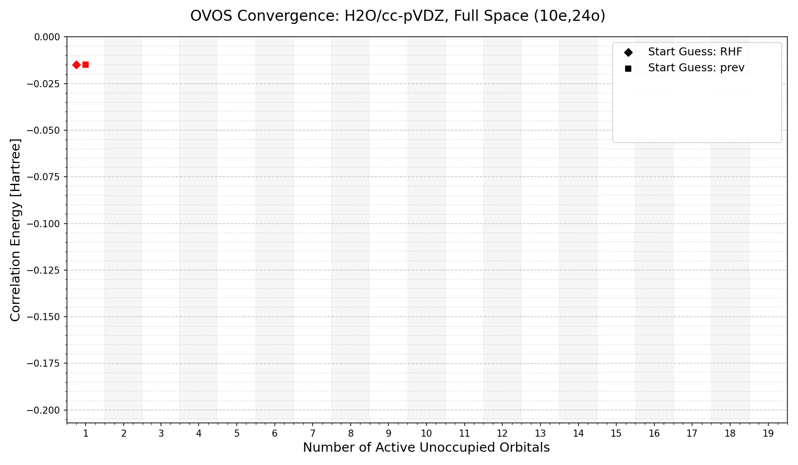

<!--
Speaker Notes: ...
- *Points:* MP2 correlation energy at each iteration.
- *Lines:* Amount of recovered correlation energy from initial point to final OVOS solution.
- *Grey Line:* Best of start Guesses (canonical HF, previous OVOS, random).
- *Dashed Lines:* Reference MP2, and orbital optimised MP2 (both with full virtual space).

-->

---

<!-- header: 
    
        Results, OVOS - H2O ***HF*** ***Li2***
    
    
        OVOS
     
-->
<!-- paginate: hold -->

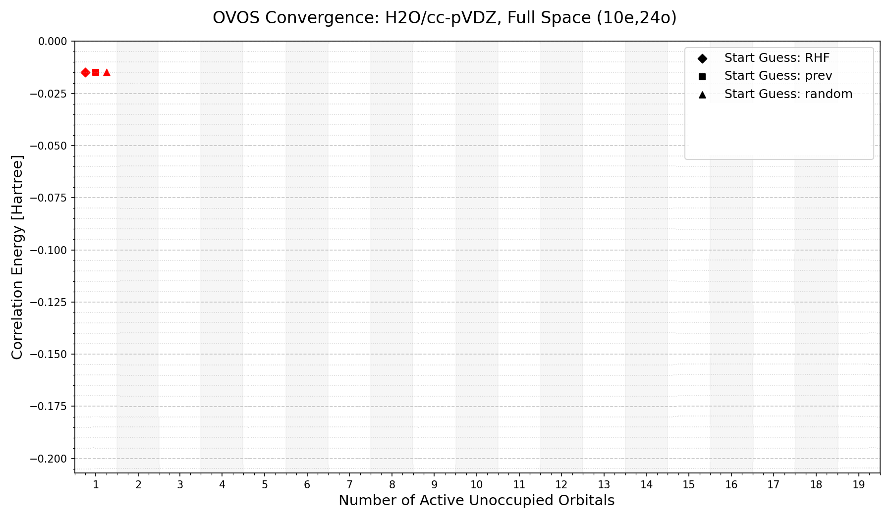

<!--
Speaker Notes: ...
- *Points:* MP2 correlation energy at each iteration.
- *Lines:* Amount of recovered correlation energy from initial point to final OVOS solution.
- *Grey Line:* Best of start Guesses (canonical HF, previous OVOS, random).
- *Dashed Lines:* Reference MP2, and orbital optimised MP2 (both with full virtual space).

-->

---

<!-- header: 
    
        Results, OVOS - H2O ***HF*** ***Li2***
    
    
        OVOS
     
-->
<!-- paginate: hold -->

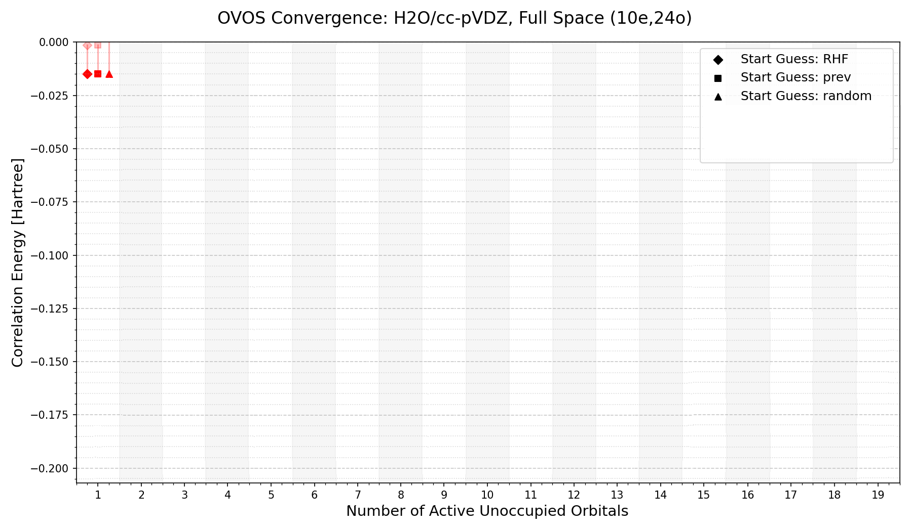

<!--
Speaker Notes: ...
- *Points:* MP2 correlation energy at each iteration.
- *Lines:* Amount of recovered correlation energy from initial point to final OVOS solution.
- *Grey Line:* Best of start Guesses (canonical HF, previous OVOS, random).
- *Dashed Lines:* Reference MP2, and orbital optimised MP2 (both with full virtual space).

-->

---

<!-- header: 
    
        Results, OVOS - H2O ***HF*** ***Li2***
    
    
        OVOS
     
-->
<!-- paginate: hold -->

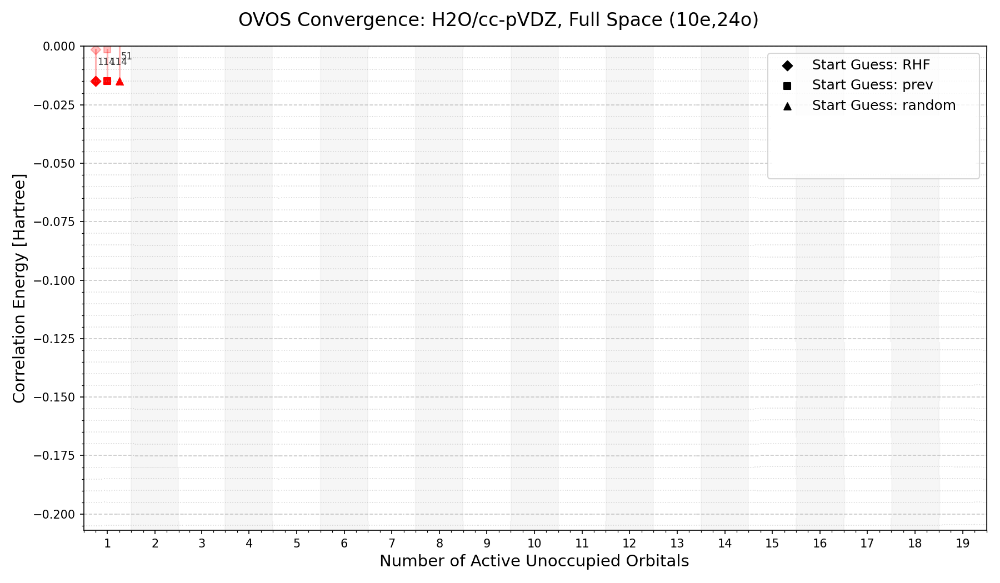

<!--
- Speaker Notes: ...
- *Points:* MP2 correlation energy at each iteration.
- *Lines:* Amount of recovered correlation energy from initial point to final OVOS solution.
- *Grey Line:* Best of start Guesses (canonical HF, previous OVOS, random).
- *Dashed Lines:* Reference MP2, and orbital optimised MP2 (both with full virtual space).

-->

---

<!-- header: 
    
        Results, OVOS - H2O ***HF*** ***Li2***
    
    
        OVOS
     
-->
<!-- paginate: hold -->

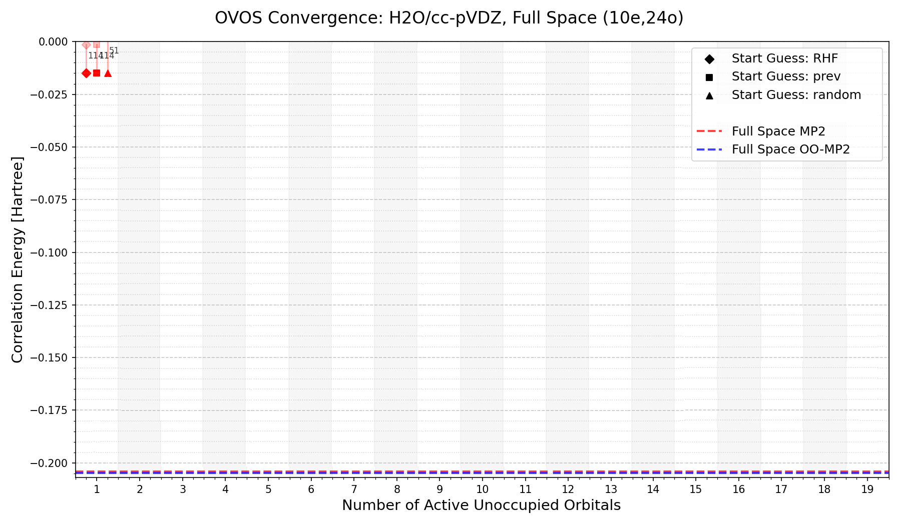

<!--
Speaker Notes: ...
- *Points:* MP2 correlation energy at each iteration.
- *Lines:* Amount of recovered correlation energy from initial point to final OVOS solution.
- *Grey Line:* Best of start Guesses (canonical HF, previous OVOS, random).
- *Dashed Lines:* Reference MP2, and orbital optimised MP2 (both with full virtual space).

-->

---

<!-- header: 
    
        Results, OVOS - H2O ***HF*** ***Li2***
    
    
        OVOS
     
-->
<!-- paginate: hold -->

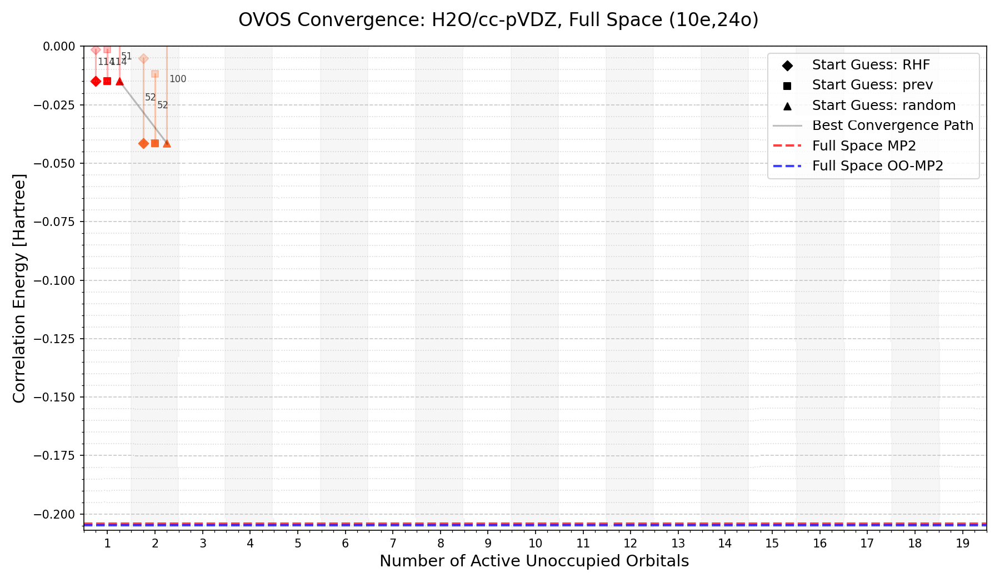

<!--
Speaker Notes: ...
- *Points:* MP2 correlation energy at each iteration.
- *Lines:* Amount of recovered correlation energy from initial point to final OVOS solution.
- *Grey Line:* Best of start Guesses (canonical HF, previous OVOS, random).
- *Dashed Lines:* Reference MP2, and orbital optimised MP2 (both with full virtual space).

-->

---

<!-- header: 
    
        Results, OVOS - H2O ***HF*** ***Li2***
    
    
        OVOS
     
-->
<!-- paginate: hold -->

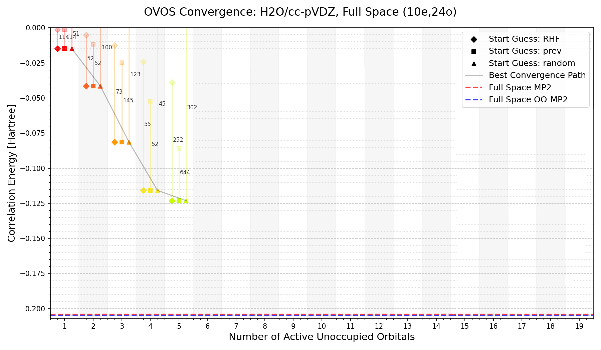

<!--
Speaker Notes: ...
- Hessian blocks start getting bigger
- 4,5 big recovery...
- iteration counts...
-->

---

<!-- header: 
    
        Results, OVOS - H2O ***HF*** ***Li2***
    
    
        OVOS
     
-->
<!-- paginate: hold -->

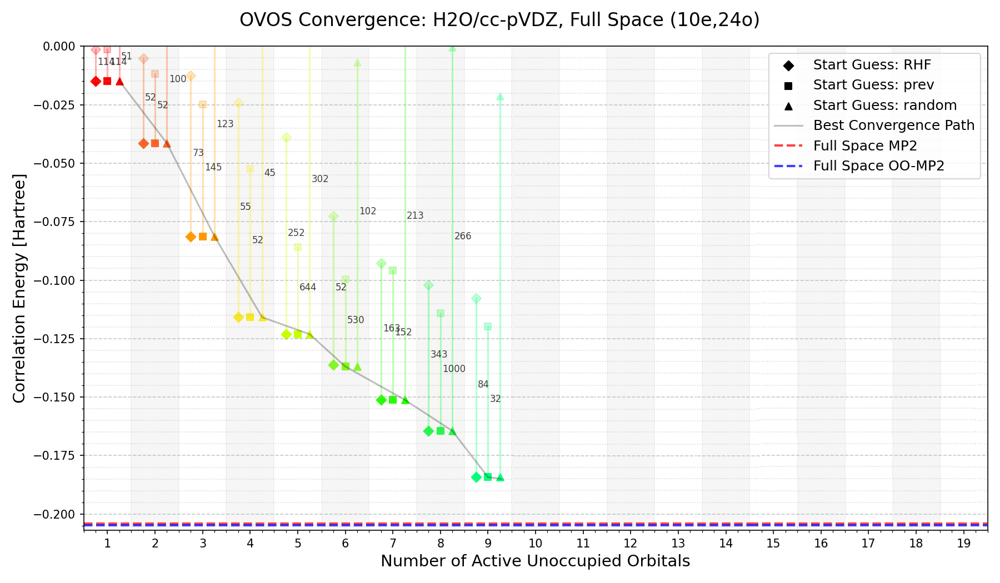

<!--
Speaker Notes: ...
- Hessian blocks start getting bigger
- 4,5 big recovery...
- iteration counts...
-->

---

<!-- header: 
    
        Results, OVOS - H2O ***HF*** ***Li2***
    
    
        OVOS
     
-->
<!-- paginate: hold -->

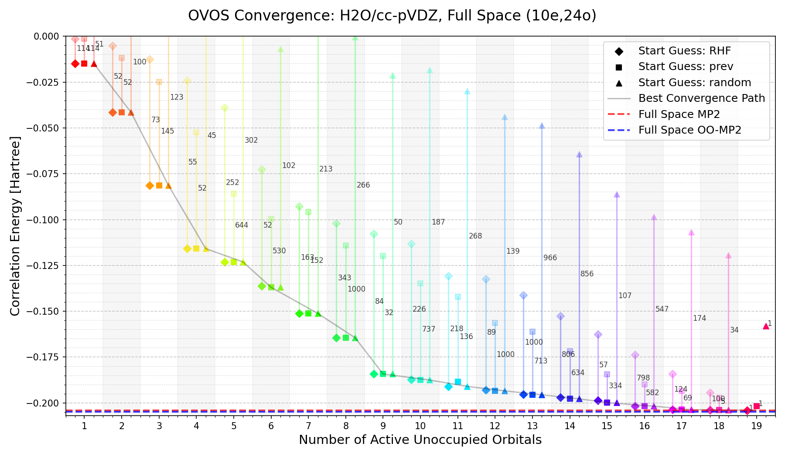

<!--
Speaker Notes: ...
- 9,10 big recovery...
-->

---

<!-- header: 
    
        Results, OVOS - H2O ***HF*** ***Li2***
    
    
        OVOS
     
-->
<!-- paginate: hold -->

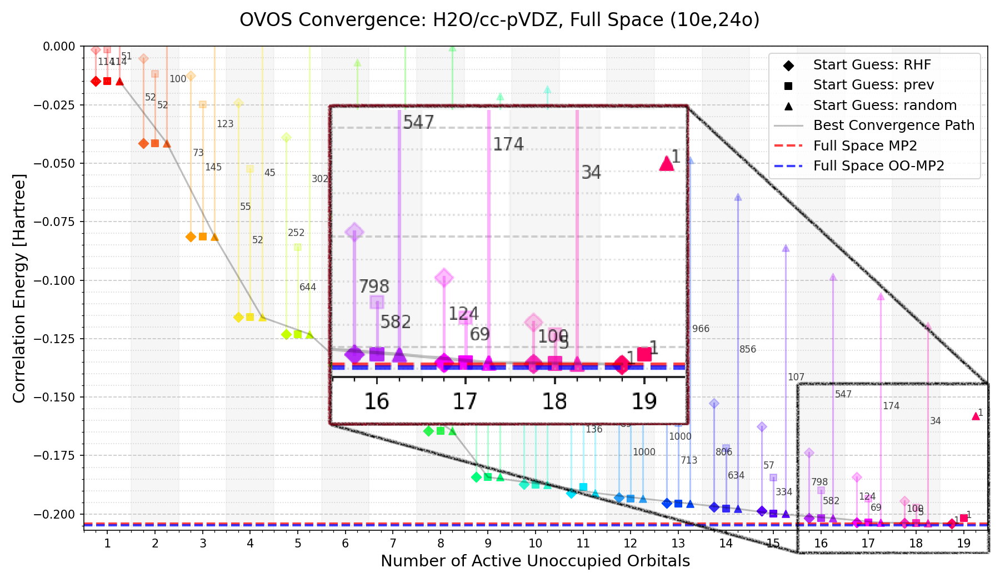

<!--
Speaker Notes: ...
- We clearly see that we do not go below MP2... with RHF OVOS, finding MP2 
-->

---

<!-- header: 
    
        Results, OVOS - H2O ***HF*** ***Li2***
    
    
        OVOS
     
-->
<!-- paginate: hold -->

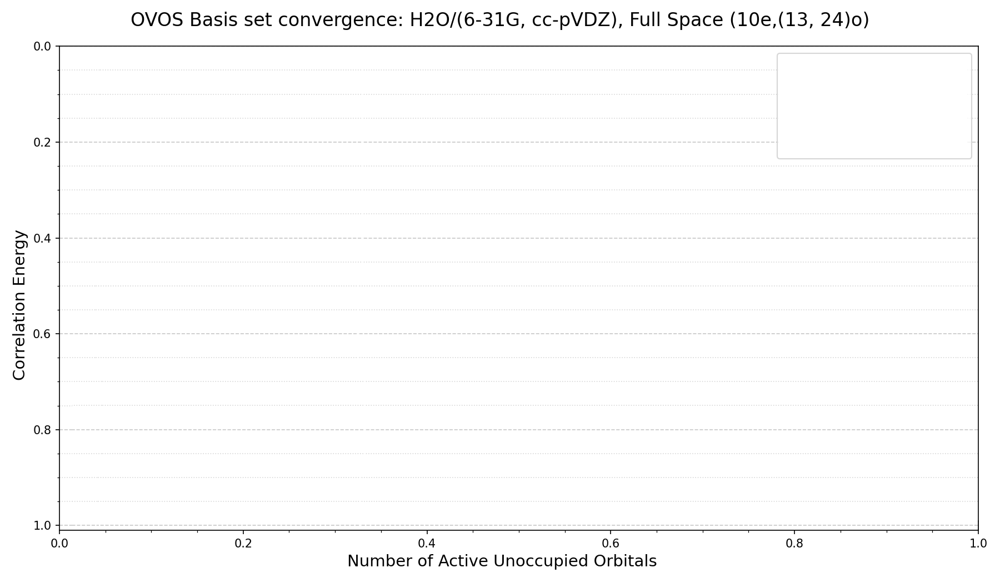

<!--
Speaker Notes: ...
-->

---

<!-- header: 
    
        Results, OVOS - H2O ***HF*** ***Li2***
    
    
        OVOS
     
-->
<!-- paginate: hold -->

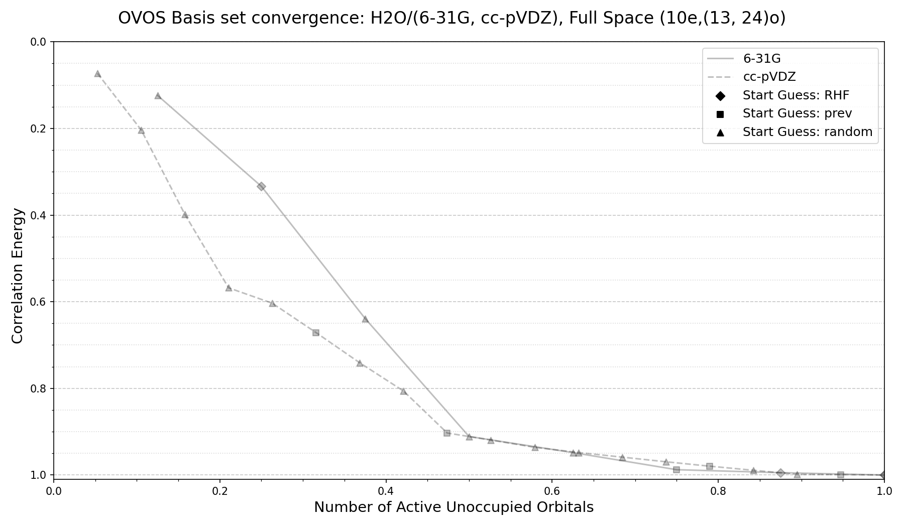

<!--
Speaker Notes: ...
- Convergence in OVOS solutions -> 90% !!!
-->

---

<!-- header: 
    
        Results, OVOS - H2O ***HF*** ***Li2***
    
    
        OVOS
     
-->
<!-- paginate: hold -->

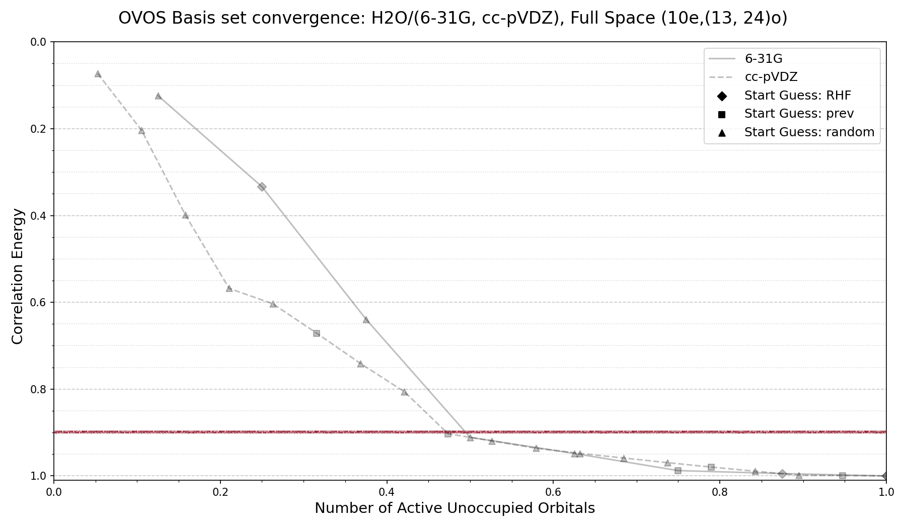

<!--
Speaker Notes: ...
-->

---

<!-- header: 
    
        Results, OVOS - H2O ***HF*** ***Li2***
    
    
        OVOS
     
-->
<!-- paginate: hold -->

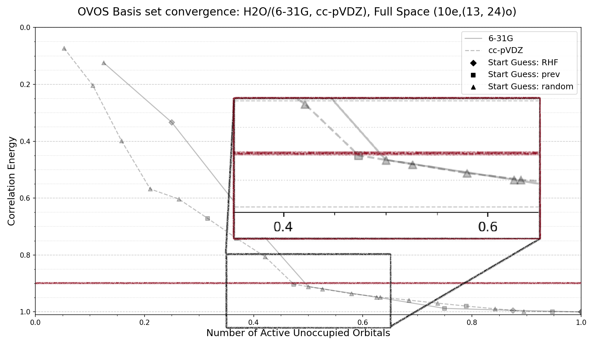

<!--
Speaker Notes: ...
-->

---

<!-- header: 
    
        Results, OVOS - ***H2O*** HF ***Li2***
    
    
        OVOS
     
-->
<!-- paginate: True -->

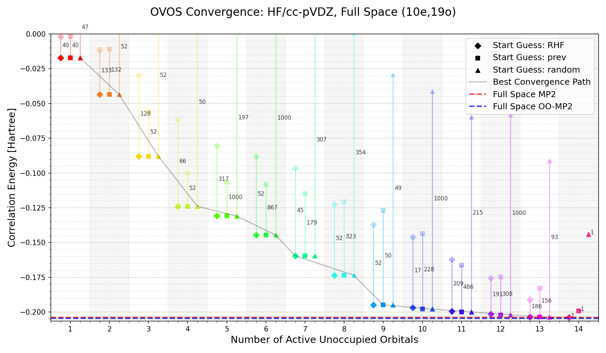

<!--
Speaker Notes: ...
-->

---

<!-- header: 
    
        Results, OVOS - ***H2O*** HF ***Li2***
    
    
        OVOS
     
-->
<!-- paginate: hold -->

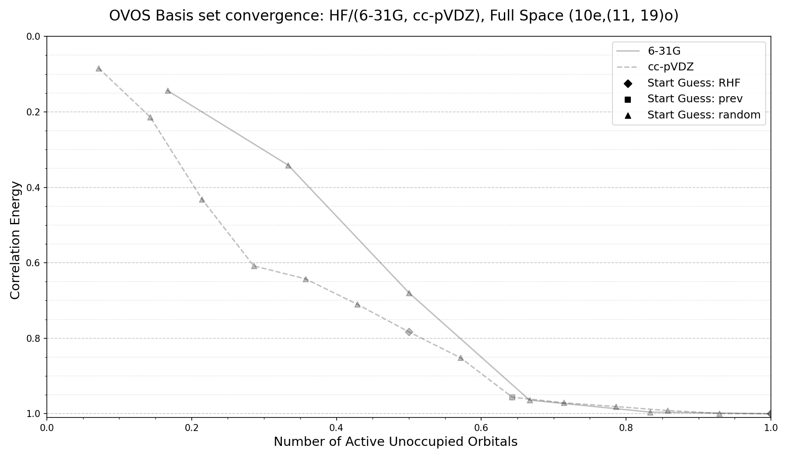

<!--
Speaker Notes: ...
-->

---

<!-- header: 
    
        Results, OVOS - ***H2O*** HF ***Li2***
    
    
        OVOS
     
-->
<!-- paginate: hold -->

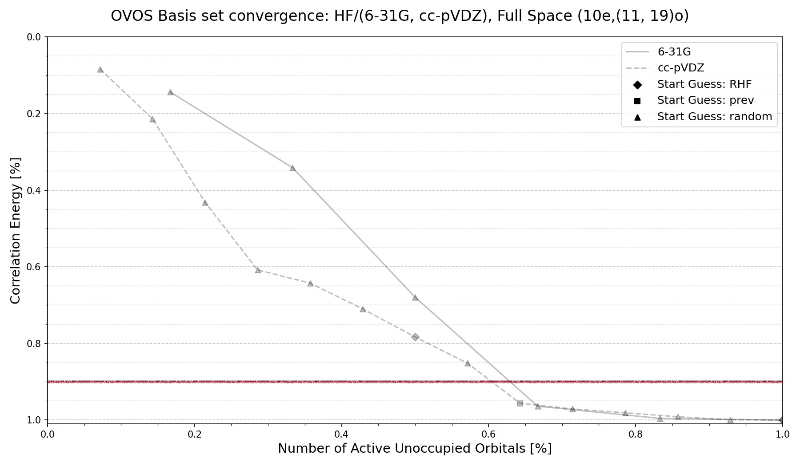

<!--
Speaker Notes: ...
-->

---

<!-- header: 
    
        Results, OVOS - ***H2O*** HF ***Li2***
    
    
        OVOS
     
-->
<!-- paginate: hold -->

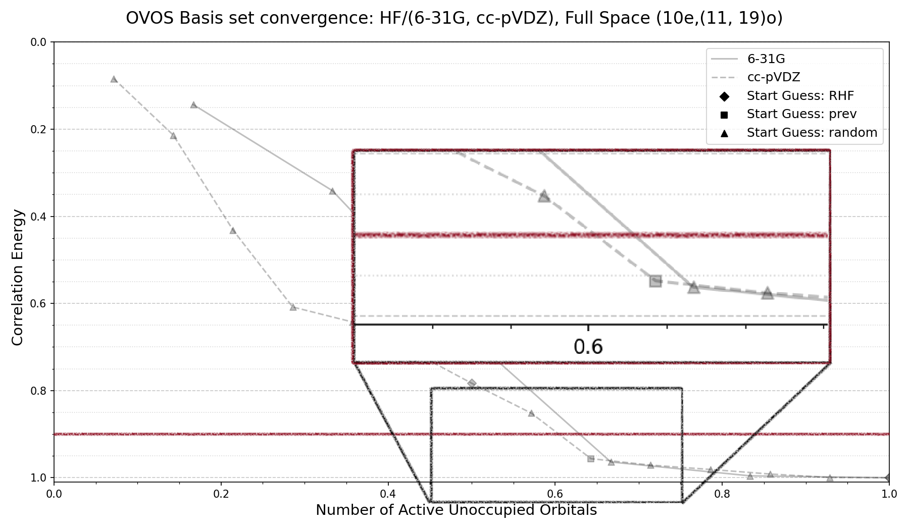

<!--
Speaker Notes: ...
-->

---

<!-- header: 
    
        Results, OVOS - ***H2O*** ***HF*** Li2
    
    
        OVOS
     
-->
<!-- paginate: True -->

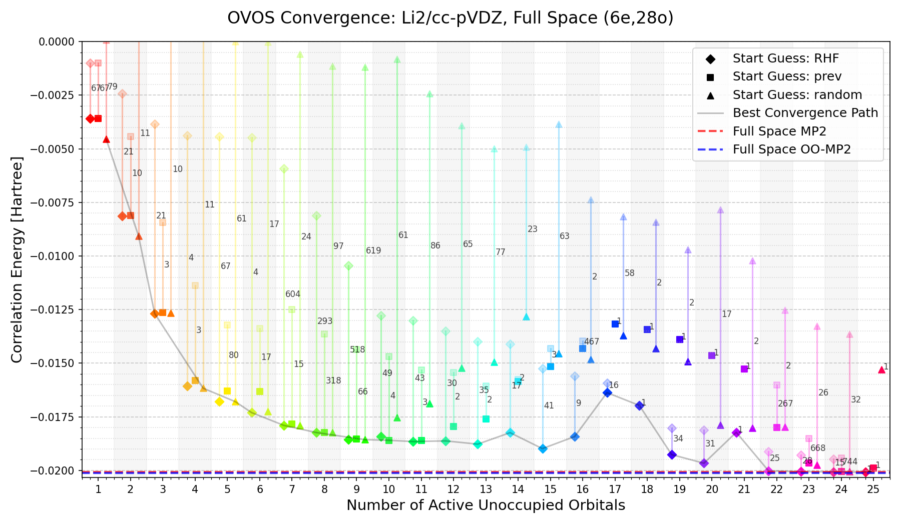

<!--
Speaker Notes: ...
-->

---

<!-- header: 
    
        Results, OVOS - ***H2O*** ***HF*** Li2
    
    
        OVOS
     
-->
<!-- paginate: hold -->

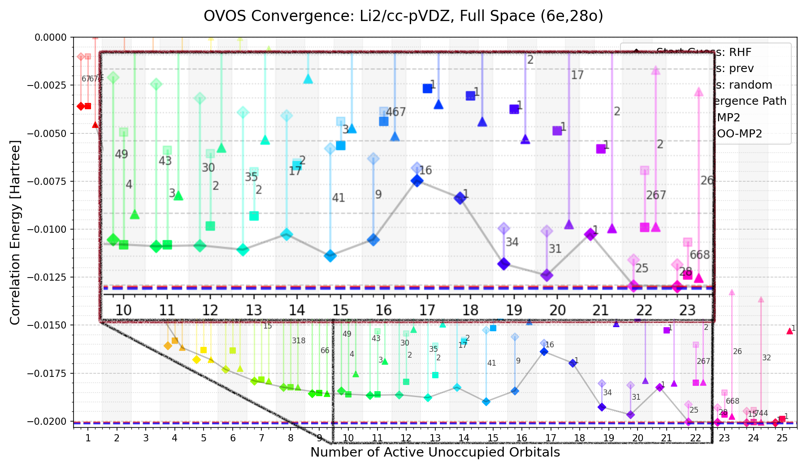

<!--
Speaker Notes: ...
-->

---

<!-- header: 
    
        Results, OVOS - ***H2O*** ***HF*** Li2
    
    
        OVOS
     
-->
<!-- paginate: hold -->

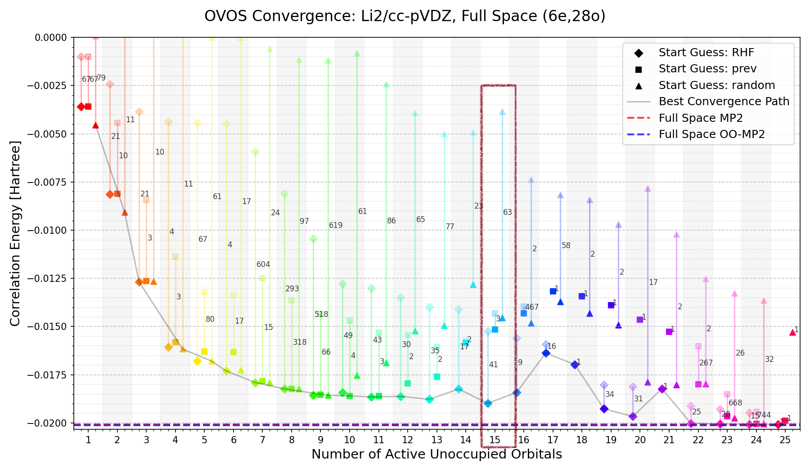

<!--
Speaker Notes: ...
-->

---

<!-- header: 
    
        Results, OVOS - ***H2O*** ***HF*** Li2
    
    
        OVOS
     
-->
<!-- paginate: hold -->

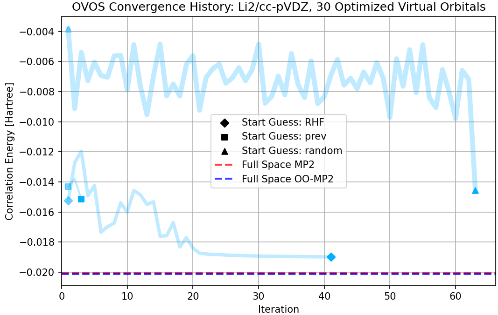

<!--
Speaker Notes: ...
- Iteration counts...
- Hessian blocks... 
- Ill-conditioned Hessian...
- Negative values -> saddle point...
-->

---

<!-- header: 
    
        Results, OVOS - ***H2O*** ***HF*** Li2
    
    
        OVOS
     
-->
<!-- paginate: hold -->

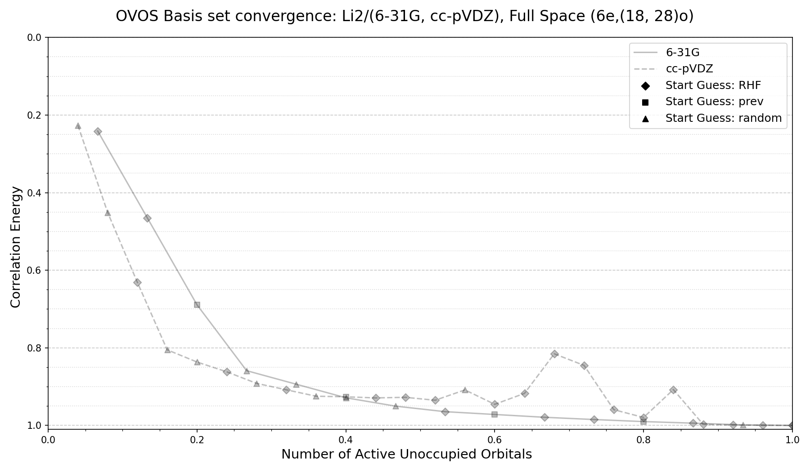

<!--
Speaker Notes: ...
-->

---

<!-- header: 
    
        Results, OVOS - ***H2O*** ***HF*** Li2
    
    
        OVOS
     
-->
<!-- paginate: hold -->

<!--
Speaker Notes: ...
-->

---

<!-- header: 
    
        Results, OVOS - ***H2O*** ***HF*** Li2
    
    
        OVOS
     
-->
<!-- paginate: hold -->

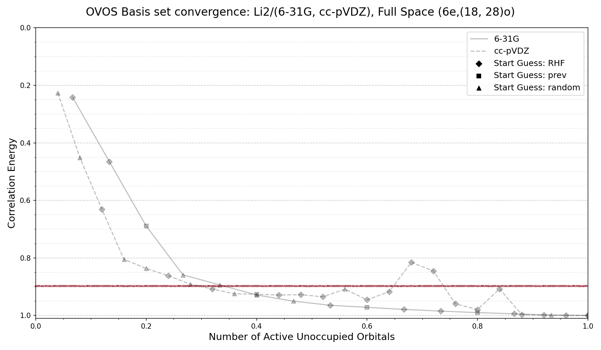

<!--
Speaker Notes: ...
-->

---

<!-- header: 
    
        Results, OVOS - ***H2O*** ***HF*** Li2
    
    
        OVOS
     
-->
<!-- paginate: hold -->

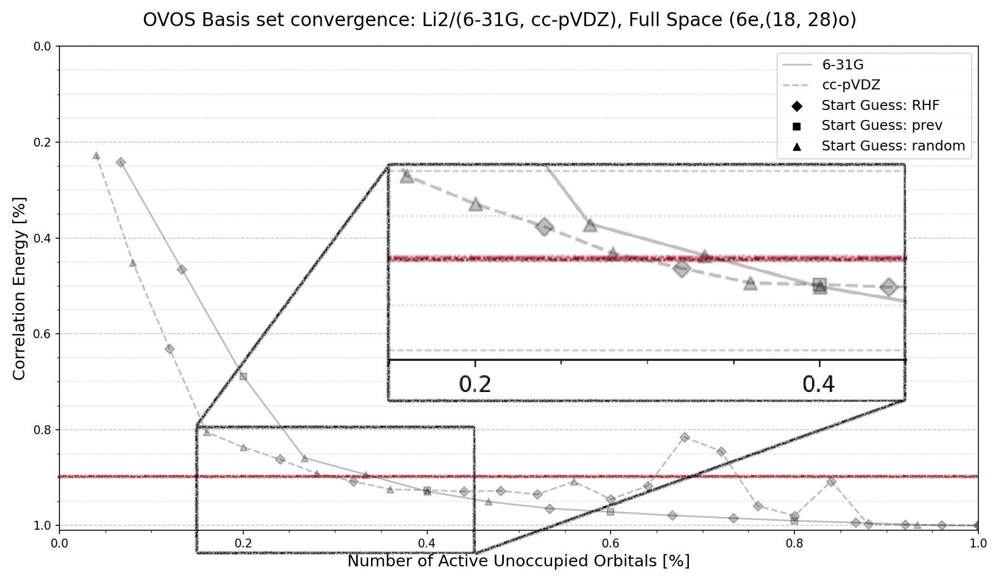

<!--
Speaker Notes: ...
-->

---

<!-- header: 
    
        Results, OVOS
    
    
        OVOS
     
-->
<!-- paginate: True -->

## Results: OVOS Summarized

| Molecule | Fullspace | $N'_{\text{virt}}$ (90% MP2) | % of full space |
|----------|----------- |------------------------------|-----------------|
| HF       | 14                | 9                            | 64%             |
| H₂O      | 19                | 13                           | 47%             |
| CO       | 21                | 13                           | 62%             |
| NH₃      | 24                | 12                           | 50%             |
| **Li₂**  | **25**                | **7**                        | **28%**         |
| CH₂$^\dagger$ | 70                | ~21                           | ~30%             |

$^\dagger$ Adamowicz & Bartlett (1992) J. Chem. Phys., 86, 1987.

**Key Takeaway:** The first 28-64% of orbitals capture the bulk of the correlation. 

<!--
Speaker Notes: ...
- All molecules
- Bartlett paper...
- Li2 is best!!! 
-->

---

<!-- header: 
    
        Results, VQE 
    
    
        OVOS
     
-->
<!-- paginate: True -->

## VQE

- **Goal:** Assess how OVOS orbitals improve VQE performance.

 

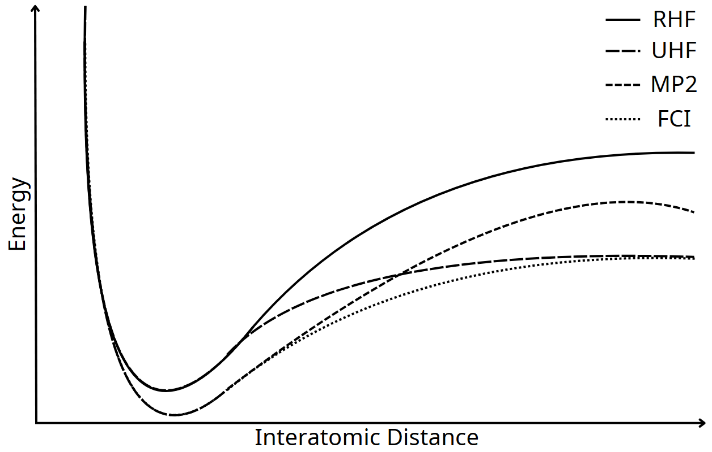

<!--
Speaker Notes: ...
-->

---

<!-- header: 
    
        Results, VQE 
    
    
        OVOS
     
-->
<!-- paginate: True -->

## VQE

- **Active space:** Strictly 75% of virtual orbitals -> >95% of correlation energy.

<!--
Speaker Notes: ...
-->

---

<!-- header: 
    
        Results, VQE - H2O ***HF*** ***Li2***
    
    
        OVOS
     
-->
<!-- paginate: True -->

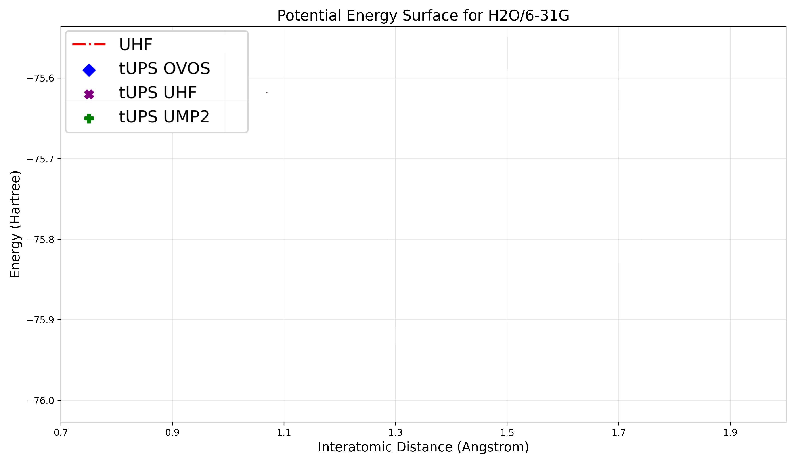

Active space: 5 occupied + 11 virtual orbitals (75% of virtual space).

<!--
Speaker Notes: ...
- *Points:* VQE energy at each iteration (Previous and Random).
- *Lines:* VQE energy convergence from initial point to final OVOS solution (UHF OVOS, UHF, and UMP2).
- *Dashed Line:* Reference UHF VQE.
- Best of previous and random initial theta parameters
- JUMP POT. SURFACE...
-->

---

<!-- header: 
    
        Results, VQE - H2O ***HF*** ***Li2***
    
    
        OVOS
     
-->
<!-- paginate: True -->

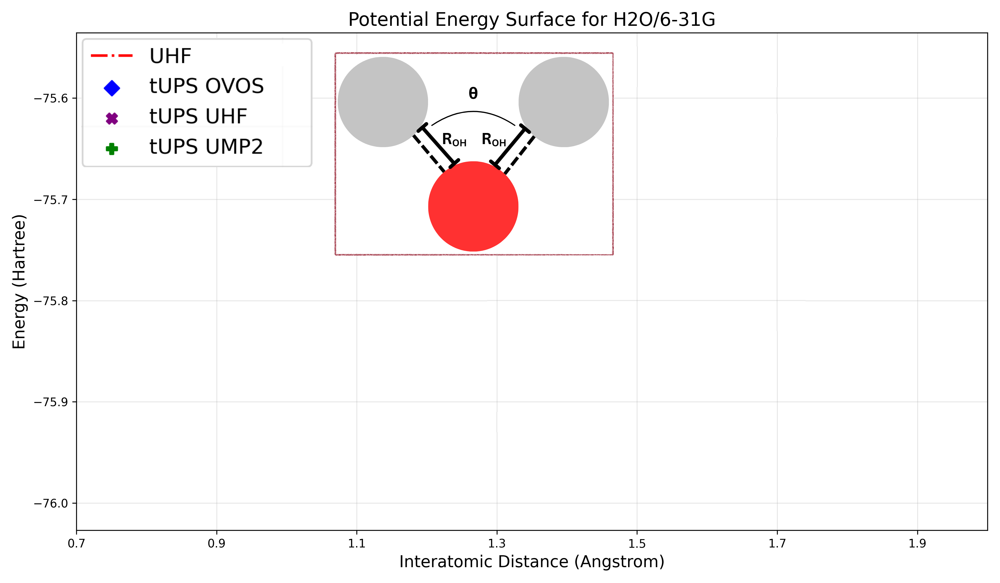

Active space: 5 occupied + 11 virtual orbitals (75% of virtual space).

<!--
Speaker Notes: ...
- *Points:* VQE energy at each iteration (Previous and Random).
- *Lines:* VQE energy convergence from initial point to final OVOS solution (UHF OVOS, UHF, and UMP2).
- *Dashed Line:* Reference UHF VQE.
- Best of previous and random initial theta parameters
- JUMP POT. SURFACE...
-->

---

<!-- header: 
    
        Results, VQE - H2O ***HF*** ***Li2***
    
    
        OVOS
     
-->
<!-- paginate: True -->

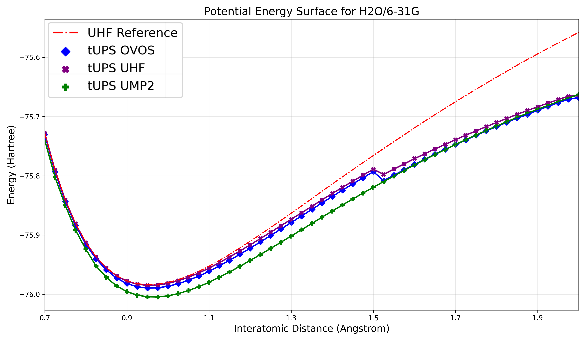

Active space: 5 occupied + 11 virtual orbitals (75% of virtual space).

<!--
Speaker Notes: ...
- *Points:* VQE energy at each iteration (Previous and Random).
- *Lines:* VQE energy convergence from initial point to final OVOS solution (UHF OVOS, UHF, and UMP2).
- *Dashed Line:* Reference UHF VQE.
- Best of previous and random initial theta parameters
- JUMP POT. SURFACE...
-->

---

<!-- header: 
    
        Results, VQE - H2O ***HF*** ***Li2***
    
    
        OVOS
     
-->
<!-- paginate: Hold -->

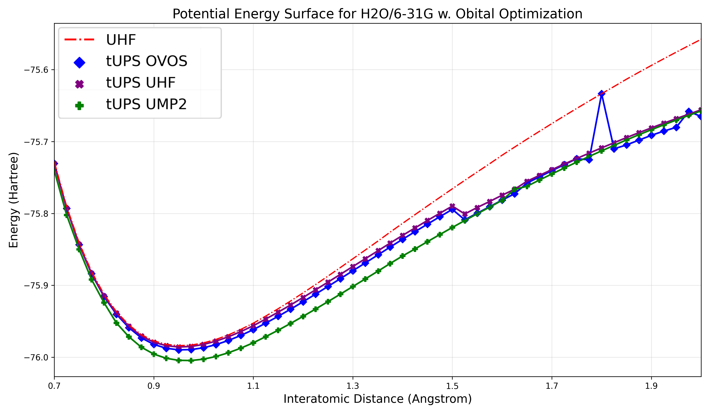

Active space: 5 occupied + 11 virtual orbitals (75% of virtual space).

<!--
Speaker Notes: ...
- Best of previous and random initial theta parameters
-->

---

<!-- header: 
    
        Results, VQE - H2O ***HF*** ***Li2***
    
    
        OVOS
     
-->
<!-- paginate: Hold -->

Active space: 5 occupied + 11 virtual orbitals (75% of virtual space).

<!--
Speaker Notes: ...
- The off poing above, is then the 1 iteration in this plot!
-->

---

<!-- header: 
    
        Results, VQE - ***H2O*** HF ***Li2***
    
    
        OVOS
     
-->
<!-- paginate: True -->

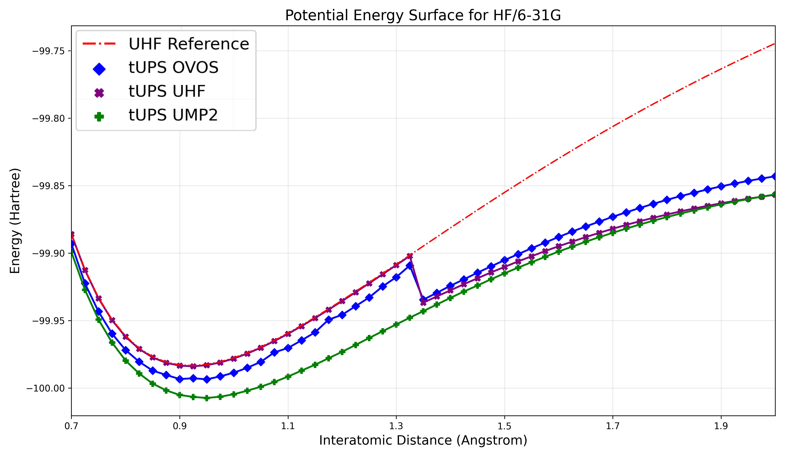

Active space: 5 occupied + 10 virtual orbitals (75% of virtual space).

<!--
Speaker Notes: ...
- Best of previous and random initial theta parameters
-->

---

<!-- header: 
    
        Results, VQE - ***H2O*** HF ***Li2***
    
    
        OVOS
     
-->
<!-- paginate: Hold -->

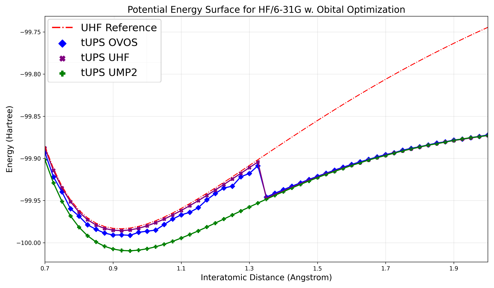

Active space: 5 occupied + 10 virtual orbitals (75% of virtual space).

<!--
Speaker Notes: ...
- Best of previous and random initial theta parameters
-->

---

<!-- header: 
    
        Results, VQE - ***H2O*** HF ***Li2***
    
    
        OVOS
     
-->
<!-- paginate: Hold -->

Active space: 5 occupied + 10 virtual orbitals (75% of virtual space).

<!--
Speaker Notes: ...
-->

---

<!-- header: 
    
        Results, VQE - ***H2O*** ***HF*** Li2
    
    
        OVOS
     
-->
<!-- paginate: True -->

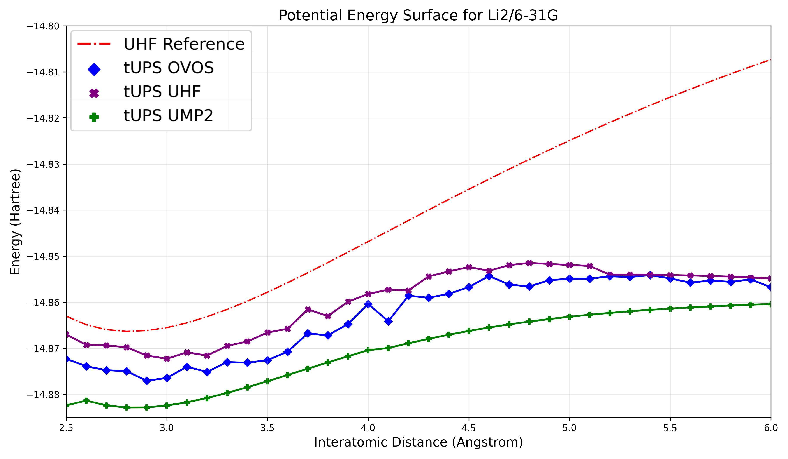

Active space: 3 occupied + 15 virtual orbitals (75% of virtual space).

<!--
Speaker Notes: ...
- Best of previous and random initial theta parameters
-->

---

<!-- header: 
    
        Results, VQE - ***H2O*** ***HF*** Li2
    
    
        OVOS
     
-->
<!-- paginate: hold -->

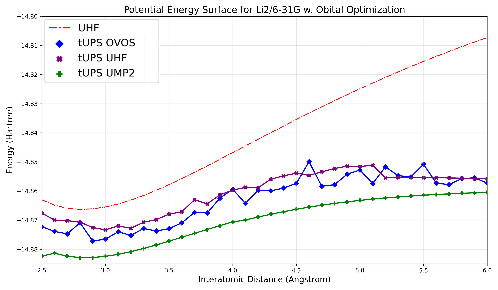

Active space: 3 occupied + 15 virtual orbitals (75% of virtual space).

<!--
Speaker Notes: ...
- Best of previous and random initial theta parameters
-->

---

<!-- header: 
    
        Results, VQE - ***H2O*** ***HF*** Li2
    
    
        OVOS
     
-->
<!-- paginate: Hold -->

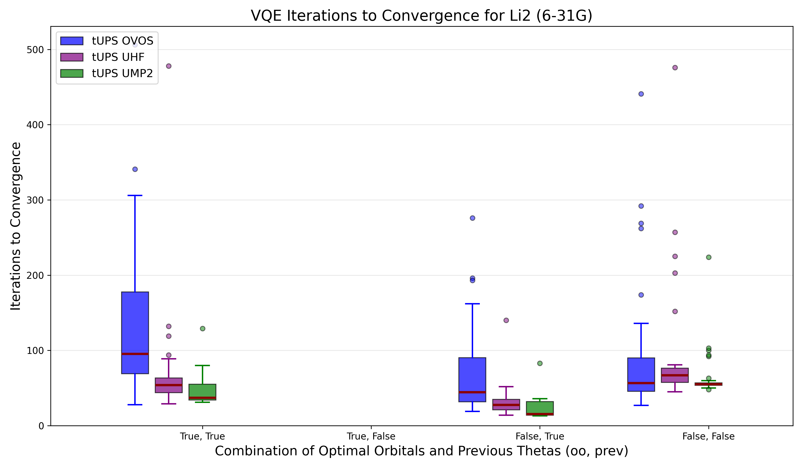

Active space: 3 occupied + 15 virtual orbitals (75% of virtual space).

<!--
Speaker Notes: ...
-->

---

<!-- header: 
    
        Results, VQE
    
    
        OVOS
     
-->
<!-- paginate: True -->

## Results: VQE Summarized

- **VQE Bottleneck:** Canonical HF is a poor trial state.
- **OVOS Advantage over UHF:** Superior trial state
$\qquad \qquad \qquad \rightarrow$ better groundstate, lower energy convergence.
- **OVOS Disadvantage over UMP2:** Inferior trial state 
$\qquad \qquad \qquad \rightarrow$ worse groundstate, higher energy convergence.
- **Metric:** Similar mean, big spread, in iterations for ooVQE.
- **Conclusion:** Classical optimisation of virtual orbitals directly reduces quantum circuit depth.

<!--
Speaker Notes: ...
-->

---

<!-- class: title-card -->
<!-- header: 
    
    
    
    
-->
<!-- paginate: Skip -->

Conclusion & Outlook

<!--
Speaker Notes: ...
-->

---
<!-- class: False -->
<!-- header: 
    
        Conclusion
    
    
        OVOS
     
-->
<!-- paginate: True -->

## Conclusion

- **Successful implementation** of OVOS.  
- **~90% MP2 correlation** recovered with **28-64% of virtual orbitals**.  
- OVOS orbitals provide **superior VQE reference states** compared to UHF.  
- Practical path to **reducing qubit count and circuit depth** for NISQ chemistry.  

<!--
Speaker Notes: ...
-->

---

<!-- header: 
    
        Outlook
    
    
        OVOS
     
-->

## Outlook

<strong>Algorithmic improvements:</strong>

- Ordering of orbitals
- Convergence for Newton‑Raphson

 

<strong>Quantum computing:</strong>

- Run VQE on quantum hardware using OVOS orbitals
- Explore reduced T1, UCCSD → UCCD ansatz, shorter circuits

<strong>Larger systems:</strong>

- Transition metals
- Periodic systems
- Basis‑sets

<!--
Speaker Notes: ...
-->

---

<!-- class: title-card -->
<!-- header: 
    
    
    
    
-->
<!-- paginate: Skip -->

Thank You!

<!--
Speaker Notes: ...
-->

---

<!-- class: title-card -->
<!-- header: 
    
    
    
    
-->
<!-- paginate: Skip -->

Thank You!

Questions?

<!--
Speaker Notes: ...
-->