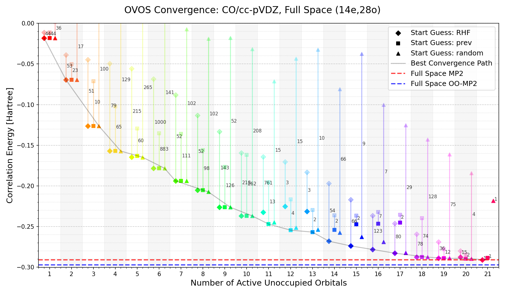
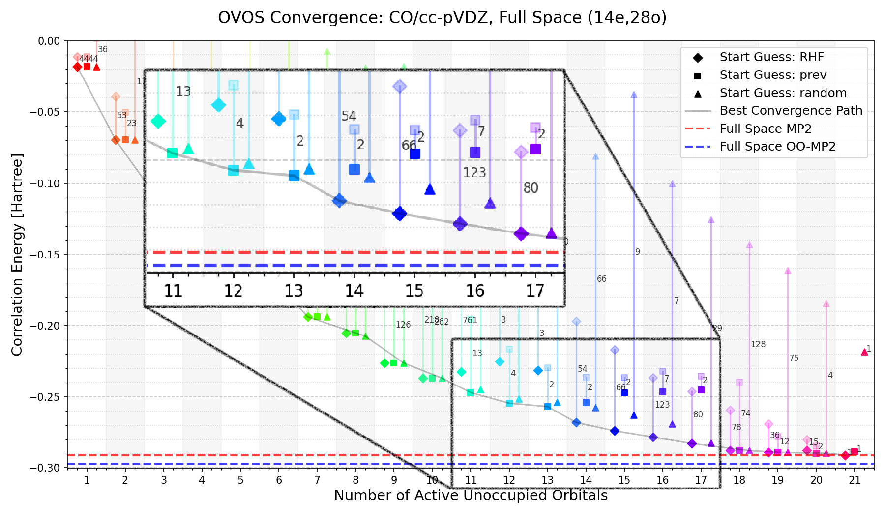
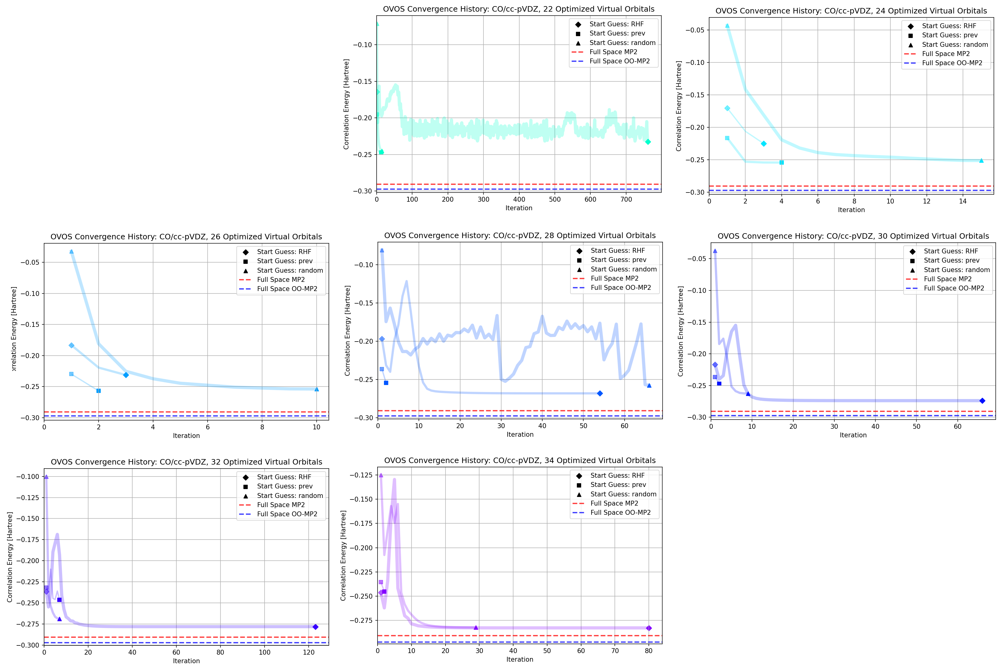
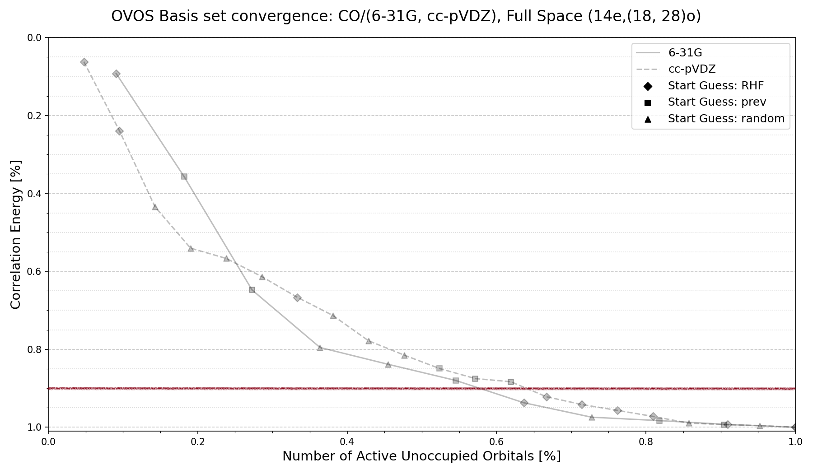
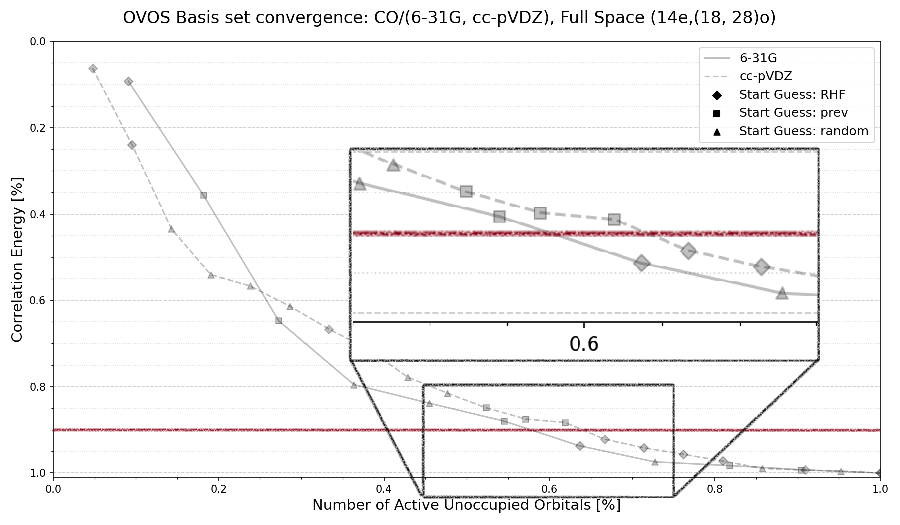
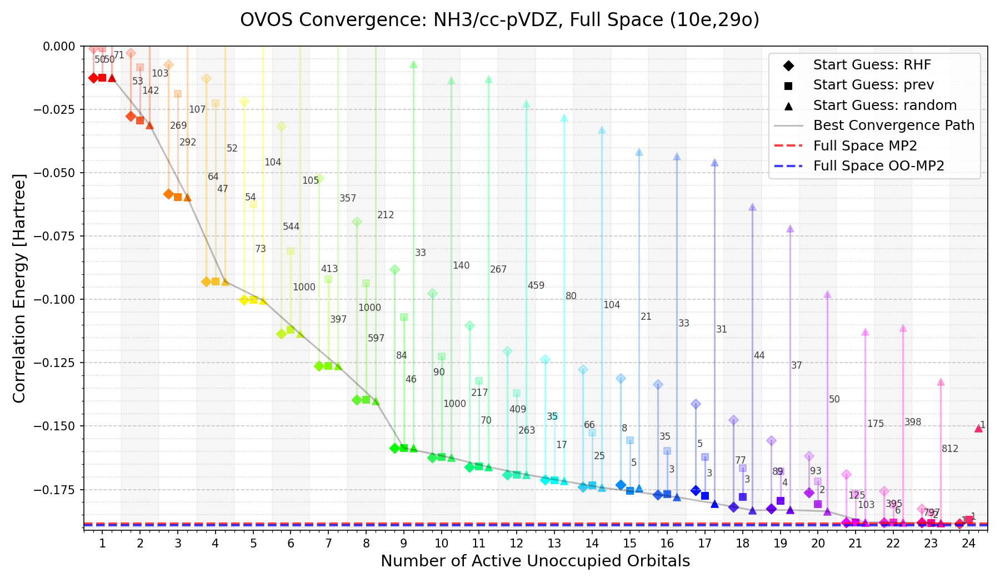
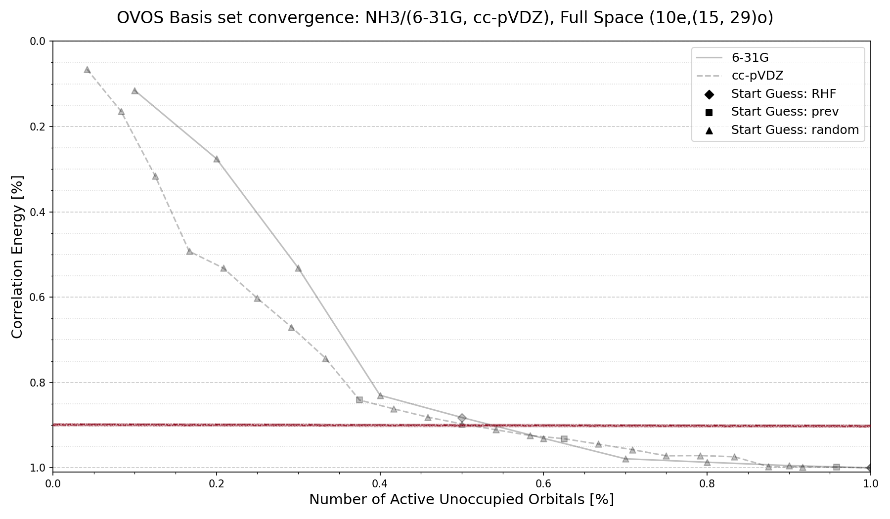
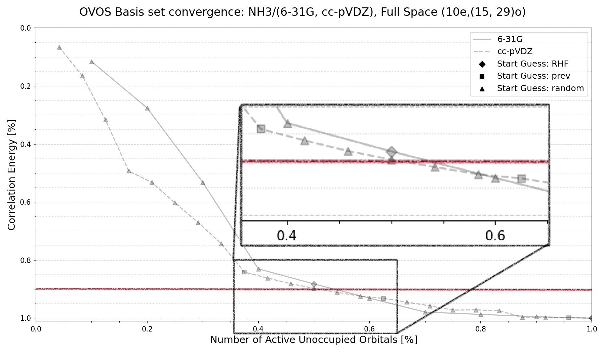

<!-- _class: lead -->
<!-- _paginate: false -->

# Optimized Virtual Orbital Space (OVOS) for Quantum Computing
## Master's Thesis Defense
**Author:** Tobias Born Clausen
**Supervisors:** Asst. Prof. Phillip W. K. Jensen and Prof. Stephan P. A. Sauer

 
 
 
 
 
 

<!--
Notes: Present for 30 mins!!! 
-->

---

<!-- header: 
    
        Motivation
    
    
        OVOS
     
-->

## Motivation: The Quantum Bottleneck

- **The Challenge:** Post-HF methods (MP2, CCSD) scale steeply $\mathcal{O}(O^2 V^2)$ due to the virtual orbital space $V$.
- **NISQ Constraint:** Near-term quantum devices (VQE) are limited by qubit count and circuit depth.
- **The Insight:** Most virtual orbitals contribute negligibly to electron correlation.
- **Thesis Goal:** Implement the *Optimized Virtual Orbital Space (OVOS)* method (Adamowicz & Bartlett, 1987) to reduce virtual orbitals while preserving correlation energy. Benchmark these orbitals for VQE performance.

  

    Adamowicz, L. & Bartlett, R. J.
    Optimized virtual orbital space for high-level correlated calculations
     [J. Chem. Phys. 86, 6314-6324 (1987)]
DOI: [10.1063/1.452468](https://doi.org/10.1063/1.452468)
  

<!--
Speaker Notes: ...
-->

---

<!-- class: title-card -->
<!-- header: 
    
    
    
    
-->
<!-- paginate: Skip -->

Theory

Partitioning - Optimisation

<!--
Speaker Notes: Title card for theory section, which covers the partitioning of the virtual orbital space and the optimisation procedure/math to find the optimal virtual subspace for correlation.
-->

---

<!-- class: False -->
<!-- header: 
    
        Theory
    
    
        OVOS
     
-->
<!-- paginate: True -->

## Theory: Partitioning

- **Index:** The virtual orbital space is partitioned into three subspaces:

 

<!--
Notes: In figure (1) the orbital space is partitioned into three subspaces: the active occupied space, active unoccupied space, and a virtual space.
Speaker Notes: The active occupied space contains the occupied orbitals, the active unoccupied space contains the virtual orbitals that are optimised, and the virtual space contains the remaining virtual orbitals that are not optimised.
- Here the orbitals are unrestricted, which is the most general case, we do not restrict the orbitals to be the same for alpha and beta electrons, which allows for more flexibility in the orbital optimisation, but also means that we have to consider both alpha and beta orbitals in the partitioning.
-->

---

<!-- class: False -->
<!-- header: 
    
        Theory
    
    
        OVOS
     
-->
<!-- paginate: hold -->

## Theory: Partitioning

- **Index:** The virtual orbital space is partitioned into three subspaces:

 

<!--
Notes: In figure (2) the orbital space is highlighted by a dashed line to show the occupied and unoccupied subspaces. 
Speaker Notes: ...
-->

---

<!-- class: False -->
<!-- header: 
    
        Theory
    
    
        OVOS
     
-->
<!-- paginate: hold -->

## Theory: Partitioning

- **Index:** The virtual orbital space is partitioned into three subspaces:

 

<!--
Notes: In figure (3) the orbital space is highlighted by a dashed line to show the active and inactive subspaces (Here i denote the letter notation).
Speaker Notes: ...
-->

---

<!-- header: 
    
        Theory, Partitioning
    
    
        OVOS
     
-->
<!-- paginate: True -->

<!-- ## Theory: Partitioning -->

- **Goal:** Find the optimal virtual subspace for capturing electron correlation.

 

<!--
Notes: No plot... Introduce Goal...
Speaker Notes: 
-->

---

<!-- header: 
    
        Theory, Partitioning
    
    
        OVOS
     
-->
<!-- paginate: hold -->

<!-- ## Theory: Partitioning -->

- **Goal:** Find the optimal virtual subspace for capturing electron correlation.

 

<!--
Notes: In figure, shown one active unoccupied orbital and the remaining virtual orbitals -> OVOS 1.
Speaker Notes: A simple approach was to select the first few virtual orbitals based on their orbital energies, but this does not guarantee optimal correlation capture...
-->

---

<!-- header: 
    
        Theory, Partitioning
    
    
        OVOS
     
-->
<!-- paginate: hold -->

<!-- ## Theory: Partitioning -->

- **Goal:** Find the optimal virtual subspace for capturing electron correlation.

 

<!--
Notes: In figure, two active unoccupied orbital and the remaining virtual orbitals are shown -> OVOS 2.
Speaker Notes: ...
-->

---

<!-- header: 
    
        Theory, Partitioning
    
    
        OVOS
     
-->
<!-- paginate: hold -->

<!-- ## Theory: Partitioning -->

- **Goal:** Find the optimal virtual subspace for capturing electron correlation.

 

<!--
Notes: In figure, N (full space - 1) active unoccupied orbital and the remaining one virtual orbital are shown -> OVOS N.
Speaker Notes: We can continue to add more active unoccupied orbitals until just before we reach the full virtual space, at full space - 1, which is the last possible OVOS solution before we reach the full virtual space.
At full space, no orbitals are optimised, and we have the canonical HF virtual orbitals, which is the starting point for the OVOS optimisation (No orbital to optimise with...) -> This becomes clear with the following slide... within each OVOS solution we perform an optimisation...
-->

---

<!-- header: 
    
        Theory
    
    
        OVOS
     
-->
<!-- paginate: True -->

## Theory: Optimisation

 

<!--
Notes: In the figure (1), the optimisation space and the occupied space...
Speaker Notes: To give the overveiw of this optimisation loop...
-->

---

<!-- header: 
    
        Theory
    
    
        OVOS
     
-->
<!-- paginate: hold -->

## Theory: Optimisation

 

<!--
Notes: In the figure (2), we optimise the unoccupied orbitals by performing a unitary rotation of the virtual orbitals, A -> A'...
Speaker Notes: ...
-->

---

<!-- header: 
    
        Theory
    
    
        OVOS
     
-->
<!-- paginate: hold -->

## Theory: Optimisation

 

<!--
Notes: In figure (3), we evaluate the new MP2 energy with the optimised virtual orbitals, and check for convergence...
Speaker Notes: ...
-->

---

<!-- header: 
    
        Theory, Optimisation
    
    
        OVOS
     
-->
<!-- paginate: True -->

### The Hylleraas Functional

- **Framework:** The **Hylleraas functional** is the mathematical target for second-order correlation energy:

$$E^{(2)} \leq \langle\Psi^{(1)}|H_0 - E^{(0)}|\Psi^{(1)}\rangle + 2\langle\Psi^{(1)}|V - E^{(1)}|\Psi^{(0)}\rangle = J_2$$

- **Functional Form:** Each unique pairs of occupied orbital indices $(i,j)$ defines a functional $J_{ij}^{(2)}$ that depends on the virtual space through the amplitudes $t_{ij}^{ab}$:

$$
\begin{align*}
    J_{ij}^{(2)} = \sum_{a>b,c>d} &t_{ij}^{ab} t_{ij}^{cd} \Big(f_{ac}\delta_{bd} - f_{ad}\delta_{bc} + f_{bd}\delta_{ac} - f_{bc}\delta_{ad} \\ &- (\epsilon_i + \epsilon_j)(\delta_{ac}\delta_{bd} - \delta_{ad}\delta_{bc})\Big) + 2\sum_{a>b} t_{ij}^{ab} \langle ij\|ab\rangle
\end{align*}
$$

<!--
Notes: Equations for the Hylleraas functional, and MP2 correlation energy...
Speaker Notes: ...
-->

---

<!-- header: 
    
        Theory, Optimisation
    
    
        OVOS
     
-->

### Derivatives

- **Gradient:** The gradient of $J_{ij}^{(2)}$ with respect to the virtual orbital rotation parameters $\kappa_{ab}$ is computed analytically.

$$
\begin{align*}
    G_{ae} = \frac{\partial J_2}{\partial R_{ae}} 
    &= 2\sum_{i>j}\sum_{b} t_{ij}^{ab} \langle ij\|eb\rangle + 2 \sum_{b} D_{ab} f_{eb}
\end{align*}
$$

- **Hessian:** The Hessian matrix is approximated using the orbital energy differences, enabling efficient optimisation.

$$
\begin{align*}
    H_{ae,bf} &= 2\sum_{i>j} t_{ij}^{ab}\langle ij\|ef\rangle
               - \sum_{i>j}\sum_c \Big[t_{ij}^{ac}\langle ij\|bc\rangle
               + t_{ij}^{bc}\langle ij\|ca\rangle\Big] \delta_{ef}
               \\ &\qquad + D_{ab}(f_{aa} - f_{bb}) \delta_{ef}
               + D_{ab} f_{ef}(1-\delta_{ef})
\end{align*}
$$

<!--
Notes: Gradient and Hessian expression for the Hylleraas functional...
Speaker Notes: ... (Want to say something about the terms and what they represent, but also want to keep it high level...)
-->

---

<!-- header: 
    
        Theory, Optimisation
    
    
        OVOS
     
-->

<!-- ## Theory: Optimisation -->
### Newton–Raphson
**Rotation:** We use the Newton–Raphson method to solve for the optimal rotation parameters $R$ that minimize the Hylleraas functional.

$$R = - G \cdot H^{-1} \quad \longrightarrow \quad H\cdot R = - G$$

### Unitary Rotation

**Coefficients:** We perform a unitary rotation of the virtual orbitals using the computed rotation parameters $R$ to generate the new orbital coefficients.

$$U = e^{R} \quad \longrightarrow \quad UCU^\dagger = C'\qquad (U^\dagger U = I) $$

<!--
Notes: Equations for the Newton–Raphson (NR) update and the unitary rotation of the orbitals...
Speaker Notes: ... (Can rewrite NR to solve for python implementation... and e^R also in python code...)
-->

---

<!-- header: 
    
        Theory, Optimisation
    
    
        OVOS
     
--> 

<!-- ## Theory: Optimisation -->
### Canonicalization

**Orbital Canonicalization:** After a rotation, we canonicalize the active unoccupied Fock block to maintain the orbital energies and ensure stability of the optimisation.

$$F^{\text{active}}_{\text{ab}} = {C'}_{\text{ab}}^\dagger F C'_{\text{ab}} \quad \longrightarrow \quad \text{Diag}(F^{\text{active}}_{\text{ab}})=C''$$

<!--
Notes: Equation for the canonicalization of the active unoccupied Fock block...
Speaker Notes: ...
-->

---

<!-- class: title-card -->
<!-- header: 
    
    
    
    
-->
<!-- paginate: Skip -->

Method

Implementation - Computational Details

<!--
Notes: Title card for Method section, which covers the implementation of the OVOS method and the computational details of the benchmarking.
Speaker Notes: ...
-->

---

<!-- class: False -->
<!-- header: 
    
        Method
    
    
        OVOS
     
-->
<!-- paginate: True -->

## Method: Implementation

**Software:** Implemented and benchmarked OVOS w. PySCF ***[1]***, and SlowQuant (VQE) ***[2]***.

  

    [1] Qiming Sun, Xing Zhang, Samragni Banerjee, et al.
    Recent developments in the PySCF program package. J. Chem. Phys., 153:024109, 2020. doi: 10.1063/5.0006074.
  

  

    [2] E. Kjellgren, K. M Ziems, et al.
    SlowQuant: A molecular quantum chemistry program written in Python for classic and quantum computing (2026)
  

  

<!--
Notes: ...
Speaker Notes: ...
-->

---

<!-- class: False -->
<!-- header: 
    
        Method, Implementation - OVOS
    
    
        OVOS
     
-->
<!-- paginate: True -->

### OVOS

  
Algorithm 1: OVOS Iterative Optimisation

  
Perform  SCF calculation

  
Select  Initial virtual orbital space

  
Transform  AO integrals to MO basis

  
Repeat 

  
 Compute MP1 amplitudes and MP2 

  
Assemble gradient and Hessian 

  
Solve Newton–Raphson

  
Generate Unitary Matrix

  
Update MO coefficients 

  
Canonicalize active Fock block

  
Evaluate new MP2 

  
Until convergence 

<!--
Notes: Algorithm for the implementation of the OVOS method, which outlines the steps taken to perform the orbital optimisation.
Speaker Notes: ...
- Implemented both restricted and unrestricted orbitals...
-->
---

<!-- header: 
    
        Method, Implementation - OVOS
    
    
        OVOS
     
-->

**Perform** SCF calculation to obtain canonical orbitals. 

<pre><code class="language-python">   # Water molecule, minimal basis
mol = pyscf.gto.Mole()
mol.atom = 'C 0 0 0; O 0 0 1.128'
mol.basis = '6-31G'
mol.unit = 'Angstrom'
mol.spin = 0
mol.charge = 0
mol.symmetry = False
mol.verbose = 0
mol.build()

   # RHF reference
mf = pyscf.scf.RHF(mol)
mf.verbose = 0
mf.kernel()

   # Initial data (RHF orbitals)
Fao = [mf.get_fock(), mf.get_fock()]
mo_coeffs = [mf.mo_coeff, mf.mo_coeff]
</code></pre>

<!--
Notes: Example code for performing the initial SCF calculation to obtain the orbitals and Fock matrices...
Speaker Notes: ...
-->

---

<!-- header: 
    
        Method, Implementation - OVOS
    
    
        OVOS
     
-->

**Select** initial virtual orbital space (canonical HF, previous OVOS, or random).

<pre><code class="language-python">   # Create OVOS object
ovos = OVOS(mol=mol,
            scf=mf,
            Fao=Fao,
            num_opt_virtual_orbs=2,  # Number of active unoccupied orbitals
            mo_coeff=mo_coeffs,
            init_orbs="RHF",
            verbose=1,
            max_iter=1000,
            conv_energy=1e-8,
            conv_grad=1e-6,
            keep_track_max=50)

   # Run the OVOS optimisation loop
E_corr, E_corr_hist, E_corr_iter, E_corr_mo, E_corr_fock, stop_reason
     = ovos.run(mo_coeffs,fock_spin=None)
</code></pre>

<!--
Notes: Example code for creating the OVOS object and running the optimisation loop...
Speaker Notes: ...
-->

---

<!-- header: 
    
        Method, Implementation - OVOS
    
    
        OVOS
     
-->

**Repeat** until convergence: ...

<pre><code class="language-python">def run(self, mo_coeffs: List[np.ndarray],
        fock_spin: Optional[np.ndarray] = None) -> dict:
    ...

    # Initial Fock if not provided
    if fock_spin is None:
        Fmo_a = mo_coeffs[0].T @ self.Fao[0] @ mo_coeffs[0]
        Fmo_b = mo_coeffs[1].T @ self.Fao[1] @ mo_coeffs[1]
        fock_spin = self._build_spin_fock(Fmo_a, Fmo_b)
        eig_a = scipy.linalg.eigh(Fmo_a, eigvals_only=True)
        eig_b = scipy.linalg.eigh(Fmo_b, eigvals_only=True)
        self.eps = self._spatial_to_spin_energies(np.real(eig_a), np.real(eig_b))
    else:
        self.eps = np.diag(fock_spin)

    ...

    while iter_count < self.max_iter:
        iter_count += 1

        prev_mo_coeffs = mo_coeffs

        # Transform and antisymmetrize ERIs
        eri_as = self._eri_vovo_antisym(mo_coeffs)

        # Compute MP1 amplitudes
        t_abij = self._mp1_amplitudes(self.eps, eri_as)
        assert np.allclose(t_abij, t_abij.transpose(1, 0, 3, 2), atol=1e-10), \
            "t_abij antisymmetry broken"

        # MP2 calculation
        E_corr = self._mp2_energy(fock_spin, t_abij, eri_as)

        # Compute T1 norm amplitudes
        t1_abij = self._mp1_t1_amplitudes(self.eps, eri_as)
        t1_norm = self._t1_norm(t1_abij)

        ...

        # Check convergence

        ...

        # Compute gradient and Hessian for Newton step
        D_ab = self._compute_density(t_abij)
        G = self._gradient(t_abij, eri_as, D_ab, fock_spin)
        H = self._hessian(t_abij, eri_as, D_ab, fock_spin)

        # Store current energy for use in _newton_step
        self.current_energy = E_corr
        self.fock_spin = fock_spin
        self.mo_coeffs = mo_coeffs

        # Solve Newton step
        R_vec = self._newton_step(G, H, iter_count, start_counting)

        # Apply rotation
        mo_coeffs, fock_spin, U_spin = self._rotate_orbitals(mo_coeffs, fock_spin, R_vec)

        # Re‑canonicalize the active virtual block
        mo_coeffs, fock_spin, evals = self._canonicalize_active(mo_coeffs, fock_spin, U_spin)

        # Update diagonal elements for next MP1 denominator (approximate, but ok)
        self.eps = np.diag(fock_spin)

        if iter_count >= self.max_iter:
            if self.verbose:
                self._print(f"Reached maximum iterations ({self.max_iter})")
            break
    ...

</code></pre>

<!--
Notes: The run method of the OVOS class, which contains the main optimisation loop. The loop includes the computation of MP1 amplitudes, MP2 energy, gradient and Hessian, and the Newton step for orbital rotation. Comment in the code, #, should be talked about and comment on... # Convergence check, and the different steps in the loop... (# Convergence check - criteria and keep_track_max...)
Speaker Notes: ...
-->

---

<!-- class: False -->
<!-- header: 
    
        Method, Implementation - VQE
    
    
        OVOS
     
-->
<!-- paginate: True -->

### VQE

 

  
Algorithm 2: VQE Workflow (Classical)

  
Perform  Orbital reference state (UHF, OVOS, UMP2) 

  
Select  Active space 

  
Set  Orbital optimization True/False

  
Initialise  Theta parameters from previous or random 

  
Run  Unrestricted wavefunction unitary product space 

  
Optimise  Theta parameters w. classical optimiser BFGS

  

    Pernille Volsgaard
    SlowQuant: Unrestricted Variational Quantum Eigensolver
       [Branch: https://github.com/erikkjellgren/SlowQuant/tree/unrestricted_vqe]
  

<!--
Notes: ...
Speaker Notes: ...
-->

---

<!-- header: 
    
        Method, Implementation - VQE
    
    
        OVOS
     
-->

**Run** Unrestricted wavefunction unitary product space.

<pre><code class="language-python">wf = UnrestrictedWaveFunctionUPS(
        mol.nelectron,
        ((mol.nelectron//2, mol.nelectron//2),
        num_electrons//2+num_opt_virtual_orbs),       # Active space
        mo_coeffs,                                    # Orbtial coefficients
        h_core,
        g_eri,
        "utups",
        {"n_layers": 1},
        include_active_kappa=False)
</code></pre>

<!--
Notes: ...
Speaker Notes: ...
-->

---

<!-- header: 
    
        Method, Implementation - VQE
    
    
        OVOS
     
-->

**Optimise:** Theta parameters w. classical optimiser BFGS.

<pre><code class="language-python">wf.run_wf_optimization_1step(
        "BFGS",
        orbital_optimization,
        atol=1e-6,
        maxiter)
</code></pre>

<!--
Notes: ...
Speaker Notes: ...
-->

---

<!-- class: title-card -->
<!-- header: 
    
    
    
    
-->
<!-- paginate: Skip -->

Results

OVOS - VQE - ooVQE

<!--
Notes: ...
Speaker Notes: ...
-->

---

<!-- class: False -->
<!-- header: 
    
        Results, Computational Details
    
    
        OVOS
     
-->
<!-- paginate: True -->

## Computational Details

- **Molecules:** H₂O, CO, HF, NH₃, Li₂.
- **Basis Set:** 6-31G, cc-pVDZ.
- **Start guesses:** Canonical HF virtual orbitals, previous OVOS, and random.
- **Convergence Criteria:** Energy change < 1e-8 a.u., gradient norm < 1e-6.
- **Software:** PySCF for SCF and integral transformations. SlowQuant for unrestricted wavefunction in VQE.

<!--
Notes: ...
Speaker Notes: ...
-->

---

<!-- header: 
    
        Results, OVOS
    
    
        OVOS
     
-->
<!-- paginate: True -->

## Results: OVOS

**OVOS plots**
- *Points:* MP2 correlation energy at each iteration.
- *Lines:* Amount of recovered correlation energy from initial point to final OVOS solution.
- *Grey Line:* Best of start Guesses (canonical HF, previous OVOS, random).
- *Dashed Lines:* Reference MP2, and orbital optimised MP2 (both with full virtual space).

<!--
Notes: ...
Speaker Notes: ...
-->

---

<!-- header: 
    
        Results, OVOS - H2O
    
    
        OVOS
     
-->
<!-- paginate: True -->

<!-- ## Results: OVOS -->
<!-- **PLOTS - H2O/cc-pVDZ** -->

<!--
- Notes: Full OVOS convergence plot for H2O in cc-pVDZ basis.
- Speaker Notes: OVOS performance in H2O with cc-pVDZ basis. The plot shows the convergence of the MP2 correlation energy as we iteratively optimise the virtual orbitals. The points represent the MP2 energy at each iteration, while the lines show the cumulative correlation energy recovered from the initial guess to the final OVOS solution. The grey line indicates the best starting guess among canonical HF, previous OVOS, and random. The dashed lines represent the reference MP2 energy with the full virtual space and the orbital optimised MP2 energy, which serves as an upper bound for correlation recovery.
- We can clearly see differences between start guesses... will keep being prominent in the following molecules.
- Most recovered correlation energy is captured in the the early to middle numbering of OVOS solutions, which is a key takeaway from the plot (4,5,9,10).
- All cases except full space converges to a UHF solution...
-->

---

<!-- header: 
    
        Results, OVOS - H2O
    
    
        OVOS
     
-->
<!-- paginate: hold -->

<!--
Notes: A zoomed in plot of OVOS H2O cc-pVDZ for the last couple of OVOS solutions, which shows the convergence to the reference MP2 energy.
Speaker Notes: We clearly see that we do not go below MP2... with RHF OVOS, finding MP2 
-->

---

<!-- header: 
    
        Results, OVOS - H2O
    
    
        OVOS
     
-->
<!-- paginate: hold -->

<!--
Notes: ...
Speaker Notes: ...
-->

---

<!-- header: 
    
        Results, OVOS - H2O
    
    
        OVOS
     
-->
<!-- paginate: hold -->

<!--
Notes: ...
Speaker Notes: ...
-->

---

<!-- header: 
    
        Results, OVOS - H2O
    
    
        OVOS
     
-->
<!-- paginate: hold -->

<!--
Notes: ...
Speaker Notes: ...
-->

---

<!-- header: 
    
        Results, OVOS - CO
    
    
        OVOS
     
-->
<!-- paginate: True -->

<!-- ## Results: OVOS -->
<!-- **PLOTS - CO/cc-pVDZ** -->

<!--
Notes: ...
Speaker Notes: ...
-->

---

<!-- header: 
    
        Results, OVOS - CO
    
    
        OVOS
     
-->
<!-- paginate: hold -->

<!-- ## Results: OVOS -->
<!-- **PLOTS - CO/cc-pVDZ** -->

<!--
Notes: ...
Speaker Notes: ...
-->

---

<!-- header: 
    
        Results, OVOS - CO
    
    
        OVOS
     
-->
<!-- paginate: hold -->

<!-- ## Results: OVOS -->
<!-- **PLOTS - CO/cc-pVDZ** -->

<!--
Notes: Figure showing the convergence of OVOS for CO in cc-pVDZ basis for 11-17 active unoccupied orbitals... keep_track_max = 50 not included in iterations...
Speaker Notes: ...
-->

---

<!-- header: 
    
        Results, OVOS - CO
    
    
        OVOS
     
-->
<!-- paginate: hold -->

<!--
Notes: ...
Speaker Notes: ...
-->

---

<!-- header: 
    
        Results, OVOS - CO
    
    
        OVOS
     
-->
<!-- paginate: hold -->

<!--
Notes: ...
Speaker Notes: ...
-->

---

<!-- header: 
    
        Results, OVOS - HF
    
    
        OVOS
     
-->
<!-- paginate: True -->

<!-- ## Results: OVOS -->
<!-- **PLOTS - HF/cc-pVDZ** -->

<!--
Notes: Figure shows consistent results between start guesses...
Speaker Notes: ...
-->

---

<!-- header: 
    
        Results, OVOS - HF
    
    
        OVOS
     
-->
<!-- paginate: hold -->

<!--
Notes: ...
Speaker Notes: ...
-->

---

<!-- header: 
    
        Results, OVOS - HF
    
    
        OVOS
     
-->
<!-- paginate: hold -->

<!--
Notes: ...
Speaker Notes: ...
-->

---

<!-- header: 
    
        Results, OVOS - NH3
    
    
        OVOS
     
-->
<!-- paginate: True -->

<!-- ## Results: OVOS -->
<!-- **PLOTS - NH3/cc-pVDZ** -->

<!--
Notes: ...
Speaker Notes: ...
-->

---

<!-- header: 
    
        Results, OVOS - NH3
    
    
        OVOS
     
-->
<!-- paginate: hold -->

<!--
Notes: ...
Speaker Notes: ...
-->

---

<!-- header: 
    
        Results, OVOS - NH3
    
    
        OVOS
     
-->
<!-- paginate: hold -->

<!--
Notes: ...
Speaker Notes: ...
-->

---

<!-- header: 
    
        Results, OVOS - Li2
    
    
        OVOS
     
-->
<!-- paginate: True -->

<!-- ## Results: OVOS -->
<!-- **PLOTS - Li2/cc-pVDZ** -->

<!--
Notes: ...
Speaker Notes: ...
-->

---

<!-- header: 
    
        Results, OVOS - Li2
    
    
        OVOS
     
-->
<!-- paginate: hold -->

<!--
Notes: ...
Speaker Notes: ...
-->

---

<!-- header: 
    
        Results, OVOS - Li2
    
    
        OVOS
     
-->
<!-- paginate: hold -->

<!--
Notes: ...
Speaker Notes: ...
-->

---

<!-- header: 
    
        Results, OVOS
    
    
        OVOS
     
-->
<!-- paginate: True -->

## Results: OVOS Summarized

| Molecule | Fullspace* | $N'_{\text{virt}}$ (90% MP2) | % of full space |
|----------|----------- |------------------------------|-----------------|
| H₂O      | 19                | 13                           | 68%             |
| CO       | 21                | 13                           | 62%             |
| HF       | 14                | 9                            | 64%             |
| NH₃      | 24                | 12                           | 50%             |
| **Li₂**  | **25**                | **7**                        | **28%**         |

*Virtual space size in cc-pVDZ basis.

**Key Takeaway:** The first 50-68% of orbitals capture the bulk of the correlation. 
All converged orbitals are unrestricted.

<!--
Notes: ...
Speaker Notes: ...
-->

---

<!-- header: 
    
        Results, VQE 
    
    
        OVOS
     
-->

## VQE

- **Goal:** Assess how OVOS orbitals improve VQE performance.
<!-- All active space is occupied + 75% of virtual space -->
<!-- VQE Diagram... -->

<!--
Notes: ...
Speaker Notes: ...
-->

---

<!-- header: 
    
        Results, VQE/ooVQE
    
    
        OVOS
     
-->

## Results: VQE/ooVQE
VQE plots

- *Points:* VQE energy at each iteration (Previous and Random).
- *Lines:* VQE energy convergence from initial point to final OVOS solution (UHF OVOS, UHF, and UMP2).
- *Dashed Line:* Reference UHF VQE.
- *ooVQE:* VQE with orbital optimisation of the virtual space.

<!--
Notes: ...
Speaker Notes: ...
-->

---

<!-- header: 
    
        Results, VQE
    
    
        OVOS
     
-->

<!-- ## Results: VQE -->

<!--
Notes: ...
Speaker Notes: ...
-->

---

<!-- header: 
    
        Results, ooVQE
    
    
        OVOS
     
-->
<!-- paginate: Hold -->

<!-- ## Results: VQE -->

<!--
Notes: ...
Speaker Notes: ...
-->

---

<!-- header: 
    
        Results, ooVQE
    
    
        OVOS
     
-->
<!-- paginate: Hold -->

<!-- ## Results: VQE -->

<!--
Notes: ...
Speaker Notes: ...
-->

---

<!-- header: 
    
        Results, VQE
    
    
        OVOS
     
-->
<!-- paginate: True -->

<!-- ## Results: VQE -->

<!--
Notes: ...
Speaker Notes: ...
-->

---

<!-- header: 
    
        Results, ooVQE
    
    
        OVOS
     
-->
<!-- paginate: Hold -->

<!-- ## Results: VQE -->

<!--
Notes: ...
Speaker Notes: ...
-->

---

<!-- header: 
    
        Results, ooVQE
    
    
        OVOS
     
-->
<!-- paginate: Hold -->

<!-- ## Results: VQE -->

<!--
Notes: ...
Speaker Notes: ...
-->

---

<!-- header: 
    
        Results, VQE
    
    
        OVOS
     
-->
<!-- paginate: True -->

<!-- ## Results: VQE -->

<!--
Notes: ...
Speaker Notes: ...
-->

---

<!-- header: 
    
        Results, ooVQE
    
    
        OVOS
     
-->
<!-- paginate: hold -->

<!-- ## Results: VQE -->

<!--
Notes: ...
Speaker Notes: ...
-->

---

<!-- header: 
    
        Results, ooVQE
    
    
        OVOS
     
-->
<!-- paginate: Hold -->

<!-- ## Results: VQE -->

<!--
Notes: ...
Speaker Notes: ...
-->

---

<!-- header: 
    
        Results, VQE/ooVQE
    
    
        OVOS
     
-->
<!-- paginate: True -->

## Results: VQE Summarized

- **VQE Bottleneck:** Canonical HF is a poor trial state.
- **OVOS Advantage:** Provides a superior trial state $\rightarrow$ better groundstate, lower energy convergence.
- **OVOS Disadvantage:** Provides an inferior trial state $\rightarrow$ worse groundstate, higher energy convergence.
- **Metric:** Reduced mean iterations for ooVQE.
- **Conclusion:** Classical optimisation of virtual orbitals directly reduces quantum circuit depth.

<!--
Notes: ...
Speaker Notes: ...
-->

---

<!-- header: 
    
        Conclusion
    
    
        OVOS
     
-->

## Conclusion

✅ **Successful implementation** of OVOS.  
✅ **~90% MP2 correlation** recovered with **50–68% of virtual orbitals**.  
✅ OVOS orbitals provide **superior VQE reference states** compared to UHF.  
✅ Practical path to **reducing qubit count and circuit depth** for NISQ chemistry.  

<!--
Notes: ...
Speaker Notes: ...
-->

---

<!-- header: 
    
        Outlook
    
    
        OVOS
     
-->

## Outlook

<strong>Algorithmic improvements:</strong>

- Initial choice of virtual orbitals
- Trust‑region / line‑search for Newton‑Raphson
- GPU acceleration, level‑shifting for indefinite Hessian

<strong>Method extensions:</strong>

- OVOS for CCSD(T) and RHF reference
- Combine with natural orbital truncation

<strong>Quantum computing:</strong>

- Run VQE on quantum hardware using OVOS orbitals
- Explore reduced T1 → UCCD ansatz, shorter circuits
 
<strong>Larger systems:</strong>

- Transition metals
- Periodic systems
- Basis‑sets

<!--
Notes: ...
Speaker Notes: ...
-->

---

<!-- header: 
    
    
    
    
-->

# Thank You!
### Questions?

<!--
Notes: ...
Speaker Notes: ...
-->
