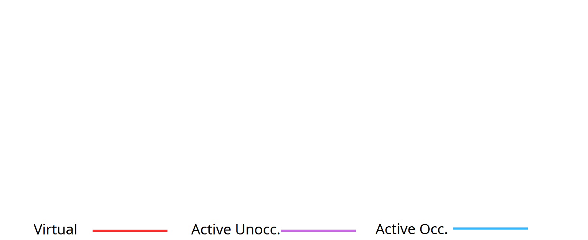
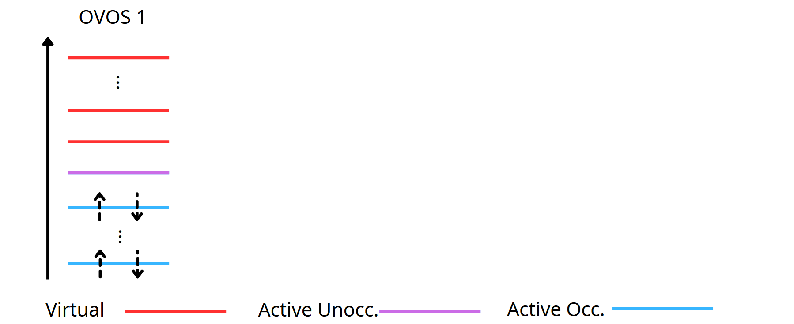
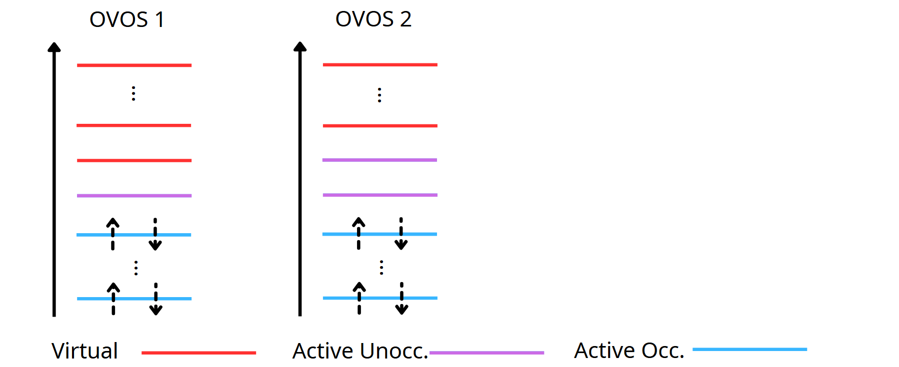
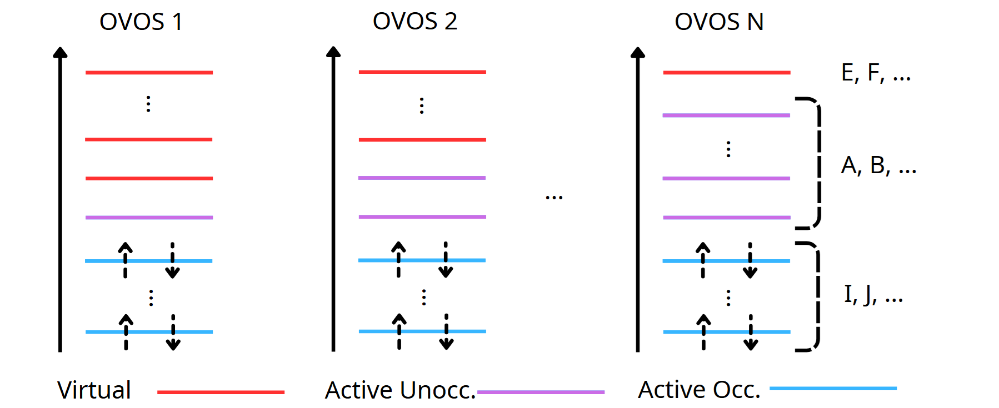
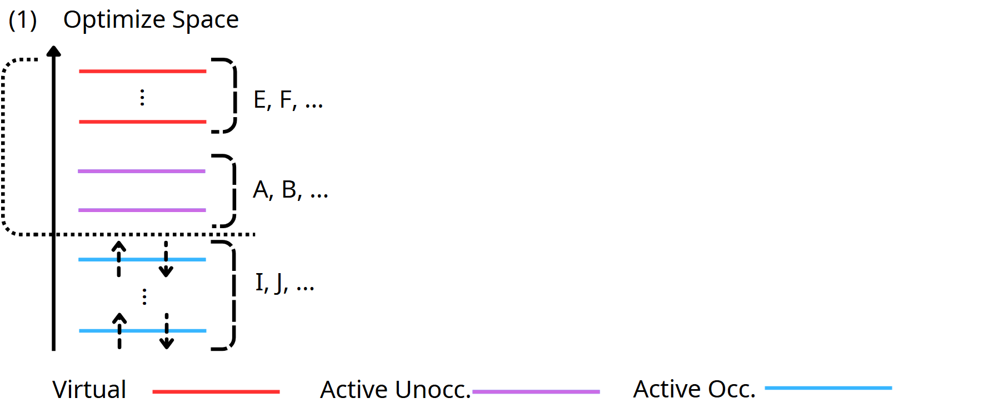
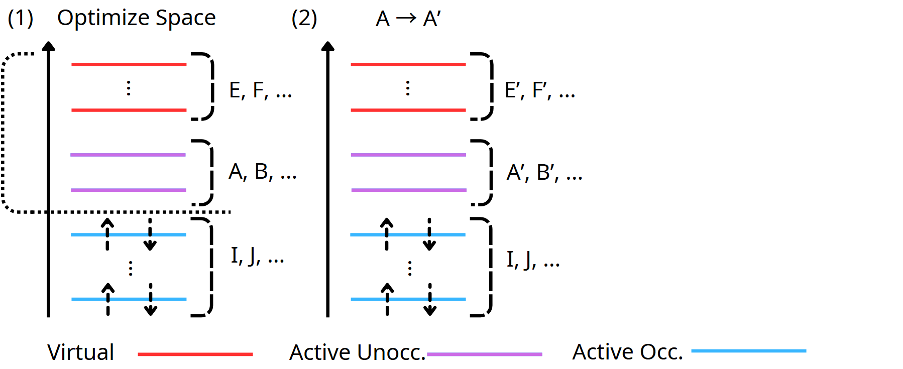
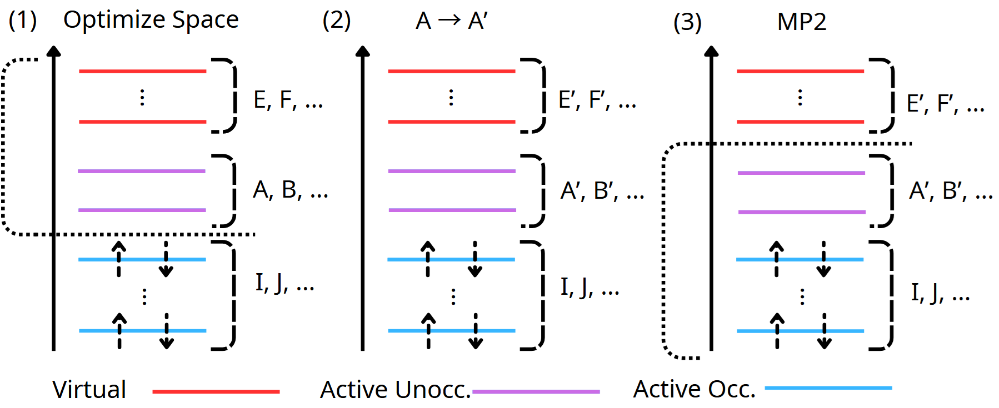
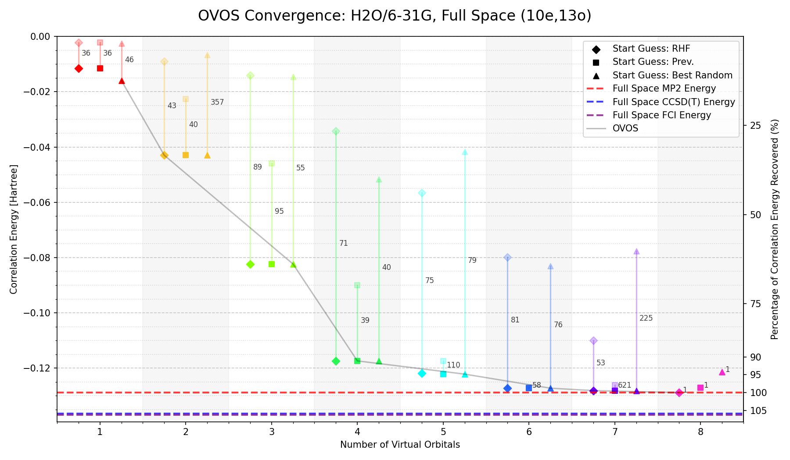
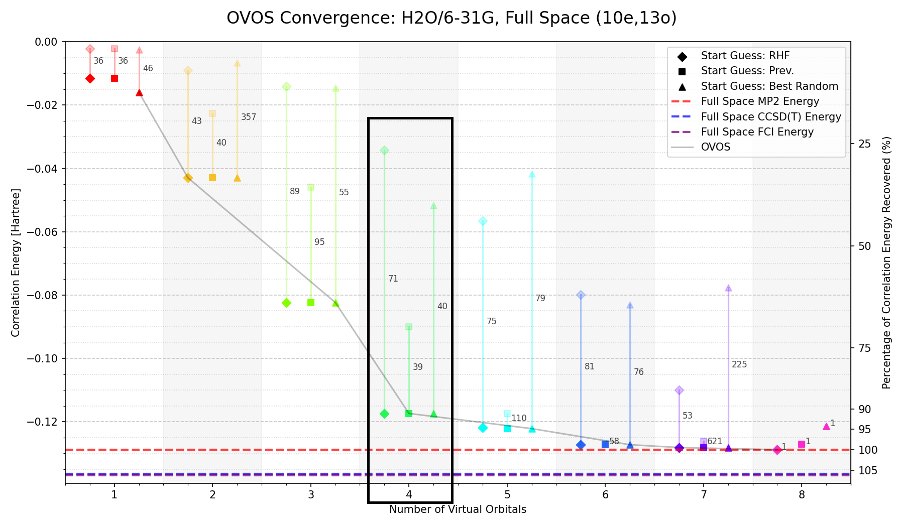

<!-- Master's thesis on **Optimized Virtual Orbitals (OVO)** for quantum computing at UCPH. Implementation based on [L. Adamowicz & R. J. Bartlett (1987)](https://pubs.aip.org/aip/jcp/article/86/11/6314/93345/Optimized-virtual-orbital-space-for-high-level) - minimizes second-order correlation energy (MP2) using orbital rotations 

Outline
1. Motivation
2. Theoretical background
3. OVOS algorithm (reference)
4. Key equations
5. Implementation details
6. Numerical results
7. Limitations & future work
8. Summary

-->

<!-- _class: lead -->
<!-- _paginate: false -->

# Optimized Virtual Orbital Space (OVOS)

#### Supervised by Assistant Prof. Phillip W. K. Jensen and Prof. Stephan P. A. Sauer

 

### Based on the work of Adamowicz & Bartlett (1987):
**Optimized virtual orbital space for high-level correlated calculations**  
Adamowicz, L. & Bartlett, R. J. [*J. Chem. Phys.* **86**, 6314-6324 (1987)]
DOI: [10.1063/1.452468](https://doi.org/10.1063/1.452468)

###### **Master's Thesis - UCPH**
###### *HQC Meeting 05/03/26*

 
 
 
 

---

<!-- header: Optimized Virtual Orbital Space (OVOS) -->

## Core Concept

**Reduce set of virtual orbitals while preserving most correlation energy.**

 

---

<!-- header: Optimized Virtual Orbital Space (OVOS) -->
<!-- _paginate: hold -->

## Core Concept

**Reduce set of virtual orbitals while preserving most correlation energy.**

 

---

<!-- header: Optimized Virtual Orbital Space (OVOS) -->
<!-- _paginate: hold -->

## Core Concept

**Reduce set of virtual orbitals while preserving most correlation energy.**

 

---

<!-- header: Optimized Virtual Orbital Space (OVOS) -->
<!-- _paginate: hold -->

## Core Concept

**Reduce set of virtual orbitals while preserving most correlation energy.**

 

---

<!-- header: Optimized Virtual Orbital Space (OVOS) -->

## Optimization Procedure

**The second-order Hylleraas functional is used to find an optimal rotation of the active unocc. against the virtual space.**

---

<!-- header: Optimized Virtual Orbital Space (OVOS) -->
<!-- _paginate: hold -->

## Optimization Procedure

**The second-order Hylleraas functional is used to find an optimal rotation of the active unocc. against the virtual space.**

 

**MP2 energy expression:**

$$
\begin{aligned}
  J_2 = \sum_{I>J} J_{IJ}^{(2)} &= \sum_{I>J} \sum_{A>B} \sum_{C>D} t_{IJ}^{AB} t_{IJ}^{CD} \big[\underbrace{\color{black}{(f_{AC} \,\delta_{BD} - f_{AD}\, \delta_{BC}) + (f_{BD}\,\delta_{AC} - f_{BC}\,\delta_{AD})}}_{\text{unoccopied Fock contributions}} \\
  &\quad \underbrace{\color{black}{- (\epsilon_{I} + \epsilon_{J})(\delta_{AC}\delta_{BD} - \delta_{AD}\delta_{BC})}}_{\text{occupied energy}}\big] + {\color{black}{2 \sum_{I>J} \sum_{A>B} t_{IJ}^{AB} \langle AB||IJ\rangle}}
\end{aligned}
$$

---

<!-- header: Optimized Virtual Orbital Space (OVOS) -->

## Optimization Procedure

**The second-order Hylleraas functional is used to find an optimal rotation of the active unocc. against the virtual space.**

 

**MP2 energy expression:**

$$
\begin{aligned}
  J_2 = \sum_{I>J} J_{IJ}^{(2)} &= \sum_{I>J} \sum_{A>B} \sum_{C>D} t_{IJ}^{AB} t_{IJ}^{CD} \big[\underbrace{\color{black}{(f_{AC} \,\delta_{BD} - f_{AD}\, \delta_{BC}) + (f_{BD}\,\delta_{AC} - f_{BC}\,\delta_{AD})}}_{\text{unoccopied Fock contributions}} \\
  &\quad \underbrace{\color{black}{- (\epsilon_{I} + \epsilon_{J})(\delta_{AC}\delta_{BD} - \delta_{AD}\delta_{BC})}}_{\text{occupied energy}}\big] + {\color{black}{2 \sum_{I>J} \sum_{A>B} t_{IJ}^{AB} \langle AB||IJ\rangle}}
\end{aligned}
$$

**MP1 amplitudes:**

$$
t_{IJ}^{AB} = \frac{\langle AB||IJ\rangle}{\epsilon_I + \epsilon_J - \epsilon_A - \epsilon_B}
$$

**Varies MO coefficients, optimizing the virtual space to minimize $J_2$.**

---
<!-- header: Optimized Virtual Orbital Space (OVOS) -->
<!-- _paginate: hold -->

## Optimization Procedure

**The second-order Hylleraas functional is used to find an optimal rotation of the active unocc. against the virtual space.**

 

---

<!-- header: Optimized Virtual Orbital Space (OVOS) -->
<!-- _paginate: hold -->

## Optimization Procedure

**The second-order Hylleraas functional is used to find an optimal rotation of the active unocc. against the virtual space.**

 

---

<!-- header: Optimized Virtual Orbital Space (OVOS) -->
<!-- _paginate: hold -->

## Optimization Procedure

**The second-order Hylleraas functional is used to find an optimal rotation of the active unocc. against the virtual space.**

 

---

<!-- header: Optimized Virtual Orbital Space (OVOS) -->

## Key Equations

**Newton-Raphson update for orbital rotations:**

$$
\mathbf{R_{EA}} = -\mathbf{G}_{EA} \cdot \mathbf{H}^{-1}_{EA,FB}, \quad\quad
\mathbf{R} =
\begin{bmatrix}
    \mathbf{0}          & \mathbf{-R_{EA}}     \\
    \mathbf{R_{AE}}     & \mathbf{0}           \\
\end{bmatrix}
$$

**define the orbital rotation by a unitary matrix U, represented in an exponential form with an antisymmetric matrix R**

$$
\mathbf{U} = e^{\mathbf{R}}, \quad\quad \mathbf{R} = - \mathbf{R}^\dagger, \quad\quad \phi_a' = \sum_b U_{ab} \phi_b + \sum_e U_{ae} \phi_e
$$

---

<!-- header: Optimized Virtual Orbital Space (OVOS) -->

## Key Equations

**Newton-Raphson update for orbital rotations:**

$$
\mathbf{R_{EA}} = -\mathbf{G}_{EA} \cdot \mathbf{H}^{-1}_{EA,FB}, \quad\quad
\mathbf{R} =
\begin{bmatrix}
    \mathbf{0}          & \mathbf{-R_{EA}}     \\
    \mathbf{R_{AE}}     & \mathbf{0}           \\
\end{bmatrix}
$$

**Gradient and Hessian expressions:**

$$
G_{EA}=\frac{\partial J_2}{\partial R_{EA}} = \underbrace{\color{black}{2\sum_{I>J}\sum_{B} t_{IJ}^{AB}\,\langle IJ||EB\rangle}}_{\text{two-electron response}} + \underbrace{\color{black}{2\sum_{B} D_{AB}\,f_{EB}}}_{\text{Fock response}}
$$

---

<!-- header: Optimized Virtual Orbital Space (OVOS) -->
<!-- _paginate: hold -->

## Key Equations

**Newton-Raphson update for orbital rotations:**

$$
\mathbf{R_{EA}} = -\mathbf{G}_{EA} \cdot \mathbf{H}^{-1}_{EA,FB}, \quad\quad
\mathbf{R} =
\begin{bmatrix}
    \mathbf{0}          & \mathbf{-R_{EA}}     \\
    \mathbf{R_{AE}}     & \mathbf{0}           \\
\end{bmatrix}
$$

**Gradient and Hessian expressions:**

$$
G_{EA}=\frac{\partial J_2}{\partial R_{EA}} = \underbrace{\color{black}{2\sum_{I>J}\sum_{B} t_{IJ}^{AB}\,\langle IJ||EB\rangle}}_{\text{two-electron response}} + \underbrace{\color{black}{2\sum_{B} D_{AB}\,f_{EB}}}_{\text{Fock response}}
$$

 

$$
\begin{aligned}
H_{EA,FB}=\frac{\partial J_2}{\partial R_{EA}R_{FB}} &= \underbrace{\color{black}{2\sum_{I>J} t_{IJ}^{AB}\langle IJ||EF\rangle}}_{\text{two-electron, off-diag}} + \underbrace{\color{black}{-\sum_{I>J}\sum_{C} \big[t_{IJ}^{AC}\langle IJ||BC\rangle + t_{IJ}^{CB}\langle IJ||CA\rangle\big]\delta_{EF}}}_{\text{two-electron, diagonal}} \\
&\quad + \underbrace{\color{black}{D_{AB}(f_{AA}-f_{BB})\delta_{EF}}}_{\text{Fock, diagonal}} + \underbrace{\color{black}{D_{AB}f_{EF}(1-\delta_{EF})}}_{ \text{Fock, off-diag}}
\end{aligned}
$$

---

<!-- header: Optimized Virtual Orbital Space (OVOS) -->
<!-- _paginate: hold -->

---

<!-- header: Optimized Virtual Orbital Space (OVOS) -->

---

<!-- header: Optimized Virtual Orbital Space (OVOS) -->

## Outlook

1) **Perhaps MO's from OVOS could be used as a better starting point for VQE, improving convergence and accuracy of quantum algorithms for correlation energy estimation.**

---

<!-- header: Optimized Virtual Orbital Space (OVOS) -->
<!-- _paginate: hold -->

## Outlook

1) **Perhaps MO's from OVOS could be used as a better starting point for VQE, improving convergence and accuracy of quantum algorithms for correlation energy estimation.**

 

2) **The MO's from OVOS might approximate Brueckner orbitals, which are known to be optimal for correlated methods. This could lead to improved performance of classical and quantum algorithms that rely on orbital optimization.**